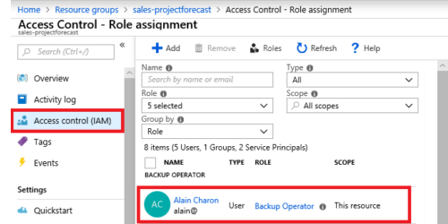

Manage access control:	

1.  Create custom role-based access control (RBAC) and Azure AD roles

**How do I manage Azure RBAC permissions?**

You manage access permissions on the Access control (IAM) pane in the Azure portal. This pane shows who has access to what scope and what roles apply. You can also grant or remove access from this pane.

The following screenshot shows an example of the Access control (IAM) pane for a resource group. In this example, Alain Charon has been assigned the Backup Operator role for this resource group.

2. Provide access to Azure resources by assigning roles at different scopes:

***How is role-based access control applied to resources?***

Role-based access control is applied to a **scope**, which is a resource or set of resources that this access applies to.

Here's a diagram that shows the relationship between roles and scopes.

Scopes include:

-   A management group (a collection of multiple subscriptions).
-   A single subscription.
-   A resource group.
-   A single resource.

When you grant access at a parent scope, those permissions are inherited by all child scopes. For example:

    -  When you assign the Owner role to a user at the management group scope, that user can manage everything in all subscriptions within the management group.

    -   When you assign the Reader role to a group at the subscription scope, the members of that group can view every resource group and resource within the subscription.

    -   When you assign the Contributor role to an application at the resource group scope, the application can manage resources of all types within that resource group, but not other resource groups within the subscription.

3. Interpret access assignments

Azure RBAC is enforced on any action that's initiated against an Azure resource that passes through Azure Resource Manager. 

RBAC uses an allow model. When you're assigned a role, RBAC allows you to perform certain actions, such as read, write, or delete. 

If one role assignment grants you read permissions to a resource group and a different role assignment grants you write permissions to the same resource group, you have both read and write permissions on that resource group.

