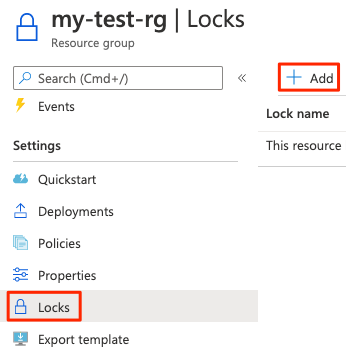
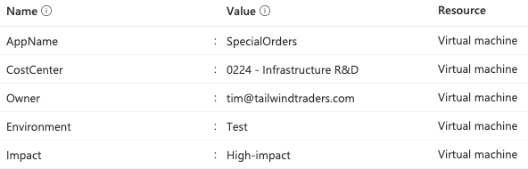

Manage Azure subscriptions and governance:	

1. Configure and manage Azure policy

- Azure Policy is a service in Azure that enables you to create, assign, and manage policies that control or audit your resources.
- Azure Blueprints enables you to define a repeatable set of governance tools and standard Azure resources that your organization requires.

2. Configure resource locks

- Resource locks prevent resources from being accidentally deleted or changed.

A *resource lock* prevents resources from being accidentally deleted or changed.

**How do I manage resource locks?**

To view, add, or delete locks in the Azure portal, go to the Settings section of any resource's Locks pane in the Azure portal.

**What levels of locking are available?**

1. **CanNotDelete** means authorized people can still read and modify a resource, but they can't delete the resource without first removing the lock.

2. **ReadOnly** means authorized people can read a resource, but they can't delete or change the resource. Applying this lock is like restricting all authorized users to the permissions granted by the Reader role in Azure RBAC.

To *modify a locked resource*, you must first remove the lock. After you remove the lock, you can apply any action you have permissions to perform. This additional step allows the action to be taken, but it helps protect your administrators from doing something they might not have intended to do.

Avoid Accidental Resource Locks Deletion by using Blueprints:

To make the protection process more robust, you can combine resource locks with Azure Blueprints. Azure Blueprints enables you to define the set of standard Azure resources that your organization requires. For example, you can define a blueprint that specifies that a certain resource lock must exist. Azure Blueprints can automatically replace the resource lock if that lock is removed.

3. Apply and manage tags on resources

- Resource tags provide extra information, or metadata, about your resources.

Resource tags are another way to organize resources. Tags provide extra information, or metadata, about your resources. This metadata is useful for:

- Resource management Tags enable you to locate and act on resources that are associated with specific workloads, environments, business units, and owners.

- Cost management and optimization Tags enable you to group resources so that you can report on costs, allocate internal cost centers, track budgets, and forecast estimated cost.

- Operations management Tags enable you to group resources according to how critical their availability is to your business. This grouping helps you formulate service-level agreements (SLAs). An SLA is an uptime or performance guarantee between you and your users.

- Security Tags enable you to classify data by its security level, such as public or confidential.

- Governance and regulatory compliance Tags enable you to identify resources that align with governance or regulatory compliance requirements, such as ISO 27001. 

- Workload optimization and automation Tags can help you visualize all of the resources that participate in complex deployments. 

**How do I manage resource tags?**

You can add, modify, or delete resource tags through PowerShell, the Azure CLI, Azure Resource Manager templates, the REST API, or the Azure portal.

You can also manage tags by using Azure Policy. For example, you can apply tags to a resource group, but those tags aren't automatically applied to the resources within that resource group. You can use Azure Policy to ensure that a resource inherits the same tags as its parent resource group. You'll learn more about Azure Policy later in this module.

You can also use Azure Policy to enforce tagging rules and conventions. For example, you can require that certain tags be added to new resources as they're provisioned. You can also define rules that reapply tags that have been removed.

4. Manage resource groups

5. Manage subscriptions

 Azure Blueprints you can define a repeatable set of governance tools and standard Azure resources that your organization requires.

 With Azure Blueprints, the relationship between the blueprint definition (what should be deployed) and the blueprint assignment (what was deployed) is preserved. In other words, Azure creates a record that associates a resource with the blueprint that defines it. This connection helps you track and audit your deployments.

 Teams often start their Azure governance strategy at the subscription level. 
 
 There are three main aspects to consider when you create and manage subscriptions: 
 - billing;  

You can create one billing report per subscription. If you have multiple departments and need to do a "chargeback" of cloud costs, one possible solution is to organize subscriptions by department or by project.
Resource tags can also help. 

 - access control;

 Every subscription is associated with an Azure Active Directory tenant. 
 
 Each tenant provides administrators the ability to set granular access through defined roles by using Azure role-based access control.

With separate subscriptions, you can control access to each one separately and isolate their resources from one another.

 - subscription limits

6. Manage costs by using alerts, budgets, and recommendations

7. Configure management groups

Management groups are also available to assist with managing subscriptions. 

A management group manages access, policies, and compliance across multiple Azure subscriptions. 