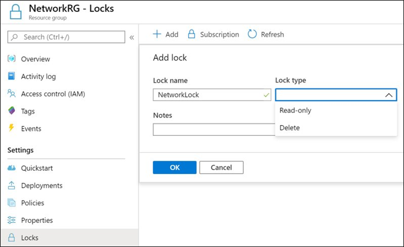

1. Azure Resource Manager locks

Resource Manager locks allow organizations to put a structure in place that prevents the accidental deletion of resources in Azure.

You can associate the lock with a subscription, resource group, or resource.
Locks are inherited by child resources.

Lock types
There are two types of resource locks.

1. Read-Only locks, which prevent any changes to the . resource.
2. Delete locks, which prevent deletion.

AzRM Locks:

2. [Conditional Access Policies](https://learn.microsoft.com/en-us/azure/active-directory/conditional-access/overview):

Conditional Access policies at their simplest are if-then statements, if a user wants to access a resource, then they must complete an action. 

Conditional Access policies:

-   User or group membership
-   Device
-   IP Location information
-   Application
-   Real-time and calculated risk detection
-   Microsoft Defender for Cloud Apps

[Conditional Access Policies](https://learn.microsoft.com/en-us/azure/active-directory/conditional-access/overview)
