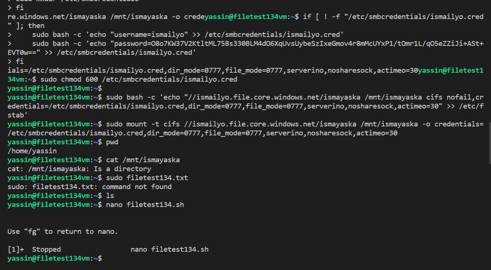
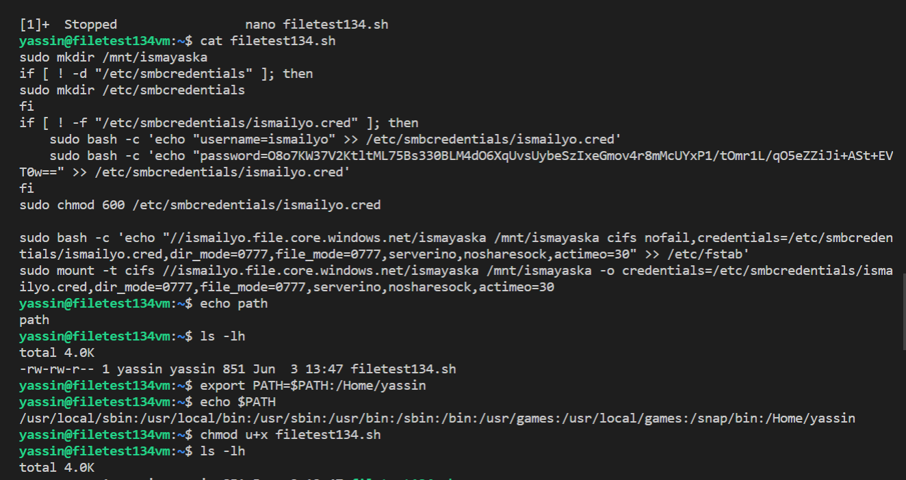
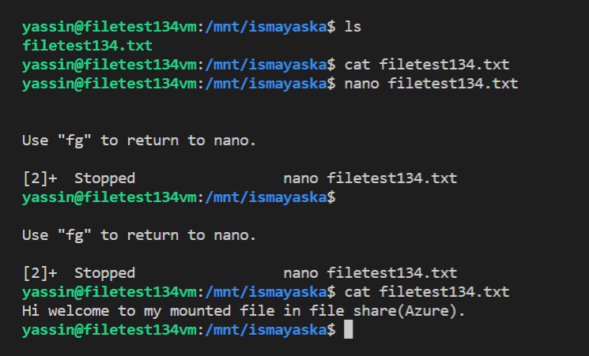

# Files:

13.4 Azure Files

-   Where can I find this service in the console?
        
    - You can find Azure File share under a tab in your Storage account. See below picture.

        
    -   How do I enable this service?

         -  You can use Azure Files when you have created a Storage account. 
        The storage account is already active, but there is nothing on it. Azure Documentation expalined that, Azure Files is really put into use when I upload a file in it.
        Below I have an example. I have uploaded a file in Azure Files share. 

        

        

 
        

        

      

    -   How can I link this service to other resources?

        -  You can link your file share to different services. You can share the file and connect to your current OS. For example, on-premises machines, which can import and use the files. You can also connect the File share to a VM(see above), which is made accessible via a private endpoint and can then be connected to the location that needs access. The configurations must be fine-tuned, which ensures that the files are available from both endpoints. Finally you can also connect it to the storage account.  

 

# Sources

https://docs.microsoft.com/en-us/azure/storage/files/storage-files-introduction

https://docs.microsoft.com/en-us/azure/storage/files/storage-files-quick-create-use-linux

https://docs.microsoft.com/en-us/azure/storage/files/storage-files-quick-create-use-windows

https://docs.microsoft.com/en-us/azure/azure-sql/database/sql-database-paas-overview?view=azuresql
