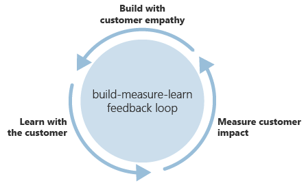
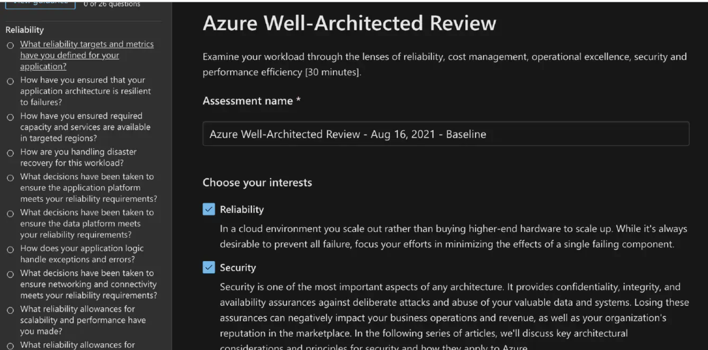
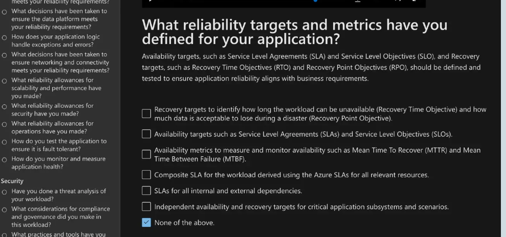
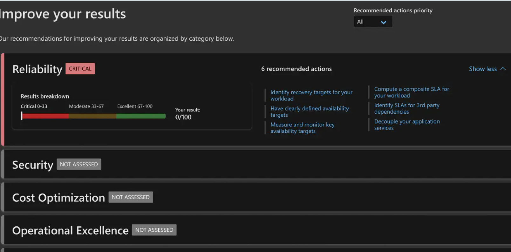

# Well-Architected Framework

The Cloud Providers benefit from their customers running good, secure applications on the provider's infrastructure. The Well-Architected Framework was created to give customers a guideline on what a good, secure application looks like.

The Well-Architected Framework of Azure and AWS are very similar(eventhough AWS has now added sustainability). They are based on almost the same 'pillars', namely:

- Cost Optimization
- Reliability
- Operational Excellence
- Performance Efficiency
- Security

In short **CROPS**.

Each pillar discusses an aspect of your application, and how the Cloud can help to optimize it.

When designing a cloud solution, focus on generating incremental value early. Apply the principles of **Build-Measure-Learn**, to accelerate your time to market while avoiding capital-intensive solutions.

That is why Azure Well-Architected Framework is a guide to improve the quality of a workload.

# Task

How to implement each pillar with cloud services

1. Cost Optimization:
 
 How can you achieve your non-functional requirements while keeping cost low?

It's five design principles in the cloud are:

    - Implement cloud financial management(Governance)
    - Adopt a consumption-based model
    - Measure overall efficiency
    - Stop spending money on undifferentiated running heavy workloads( incorporate PaaS options).
    - Analyzing and allocating expenses.

2. Reliability:

How are you protecting the system/App against potential failures?

Five design principles of Reliability in the cloud are:

    - Automatically recover from an error(self healing)
    - Test recovery procedures
    - Horizontally scale to increase total workload availability
    - Stop guessing capacity(Build resiliency and availability in the App requirement)
    - Manage change in automation
  

3. Operational Excellence(OE):

Technical architecture is one aspect of your solution, but are you prepared to monitor and run the system when it goes live?

Five design principles of OE in the cloud are:

    - Make edits as code(application deployment as code)
    - Make small, reversible changes regularly(Devop principles)
    - Refine surgery procedures regularly (monitoring)
    - Anticipate failure(testing)
    - Learn from all operational mistakes

4. Performance Efficiency:

Have you considered how your application scales as part of your design?

The five design principles performance efficiency in the cloud are:

    - Democratizing advanced technologies(Choreography= each component of the system participate in the decision-making process about the workflow of a business transaction)
    - Go worldwide in minutes
    - Using serverless architectures(Geodes=Deploy backend services into a set of geographical nodes, each of which can service any client request in any region)
    - Experiment more often
    - Consider mechanical sympathy

5. Security:

What happens if someone tries to attack your solution?

Seven design principles of security in the cloud are:

    - Implement a strong identity foundation(IAM)
    - Enable traceability
    - Apply security to all layers(Network security and containment)
    - Automate security best practices
    - Protect data in transit and at rest
    - Prepare for security events(security operations)

In each of the pillars you can use the Well-architectured framework in Azure to help you consider the core design requirements of your solution with recommendations to improve score for those pillars, as well as an overall score.

 

# Challenges overcame
none because i knew about the topic from AWS.

# Sources

https://docs.microsoft.com/en-us/azure/architecture/framework/

https://www.cloudwithchris.com/blog/azure-well-architected-framework/

