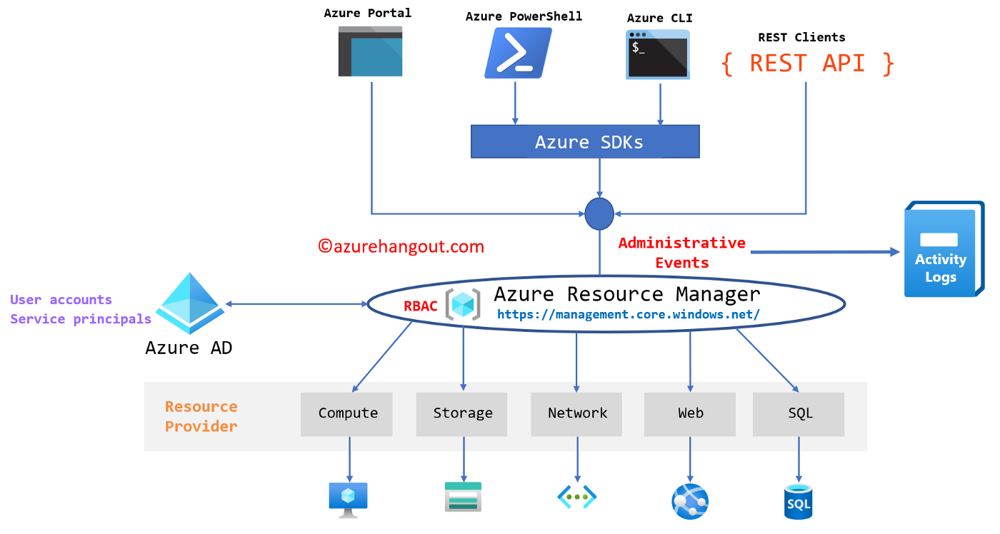
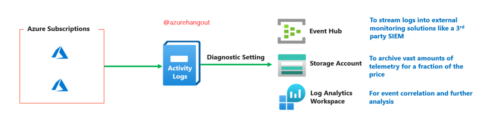

# Azure Activity Log

Activity logs records events from multiple sources.

#### Key terms

- The GET method;

The GET method is used to retrieve data from the server. This is a read-only method, so it has no risk of mutating or corrupting the data. For example, if we call the get method on our API, we’ll get back a list of all to-dos.

- The POST method;

This method is used to create a new data entry.
So it sends data to the server and creates a new resource.

- The PUT method;

The PUT method is most often used to update an existing resource. If you want to update a specific resource (which comes with a specific URI), you can call the PUT method to that resource URI with the request body containing the complete new version of the resource you are trying to update.

- The DELETE method;

The DELETE method is used to delete a resource.

**What is Azure Activity Log for?**

#### Administrative Events

- It logs all write operations (PUT, POST, DELETE) for Azure management API endpoints. 

- It logs the start of the operation and subsequent success or failure of the operation

- It doesn’t include read operations (GET)

- It also logs Azure role assignments (the operation to assign resource permissions to identities).

- If a resource is not available, an “unavailable” status notification will be logged in activity logs.

- If a service health incident/notification occurs, an event is automatically logged in activity logs by the Azure platform under this category.

- The start and status of all autoscaling events are logged in Activity logs.

- If an issue is detected by Security Center, a notification will be logged in activity logs.

**Where the logs stored and for how long?**

The logs are stored on the Azure platform for 90 days.

This means that we can only view the activity logs only for the last three months.

**How to combine Activity log to other services**

You can use a management tool like Azure Portal, Azure CLI, Azure PowerShell, SDKs or Direct API calls.

There is consistent logging irrespective of the management tool being used because of Azure singular management layer — Azure Resource Manager — ARM (Figure below). This is because the logging happens at the ARM endpoint.

Connect with Azure subscription.

# Sources

https://docs.microsoft.com/en-us/azure/azure-monitor/essentials/activity-log

https://docs.microsoft.com/en-us/azure/service-health/service-notifications

https://davidokeyode.medium.com/understanding-azure-logs-part-1-activity-logs-e5483c7b8a46

