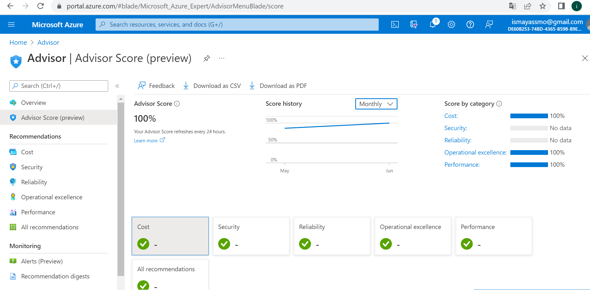

# Azure Advisor

Helps to follow best practices in order to optimize the Azure deployments. 

**What is Azure Advisor for?**

It analyzes your resource configuration and usage readings and then recommends solutions that can help you improve the cost effectiveness, performance, reliability (formerly called High availability), and security of your Azure resources.

**Advisor score calculation example:**

Single subscription score: 

This example is the simple mean of all Advisor category scores for your subscription. If the Advisor category scores are - Cost = 73, Reliability = 85, Operational excellence = 77, and Performance = 100.

Then the Advisor score would be 

(73 + 85 + 77 + 100)/(4x100) = 0.84% or 84%.

Multiple subscriptions score: 

When multiple subscriptions are selected, the overall Advisor scores generated are weighted aggregate category scores.

The recommendations are divided into five categories:

1. Reliability (formerly called High Availability):

To ensure and improve the continuity of your business-critical applications. For more information.

2. Security: 

To detect threats and vulnerabilities that might lead to security breaches. For more information.

3. Performance: 

To improve the speed of your applications. For more information.

4. Cost: 

To optimize and reduce your overall Azure spending. For more information.

5. Operational Excellence: 

To help you achieve process and workflow efficiency, resource manageability and deployment best practices. 

**How can I combine Azure advisor with other services?**

Advisor provides recommendations for Application Gateway, App Services, availability sets, Azure Cache, Azure Data Factory, Azure Database for MySQL, Azure Database for PostgreSQL, Azure Database for MariaDB, Azure ExpressRoute, Azure Cosmos DB, Azure public IP addresses, Azure Synapse Analytics, SQL servers, storage accounts, Traffic Manager profiles, and virtual machines.

**Comparison**

Azure advisor is free to use while AWS trusted advisor offers free recommendations for core checks and full trusted advisor for Business and Enterprise.

# Sources

https://docs.microsoft.com/en-us/azure/advisor/advisor-overview

https://docs.microsoft.com/en-us/azure/advisor/azure-advisor-score