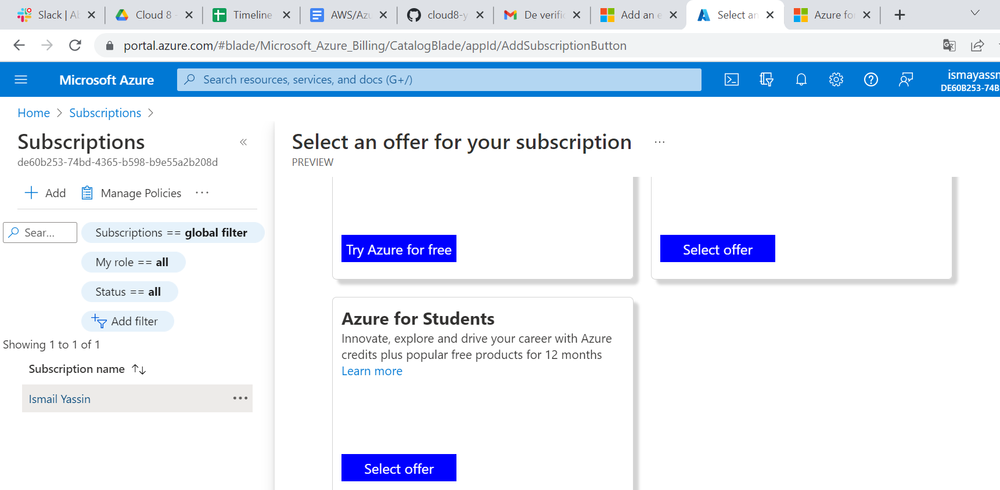
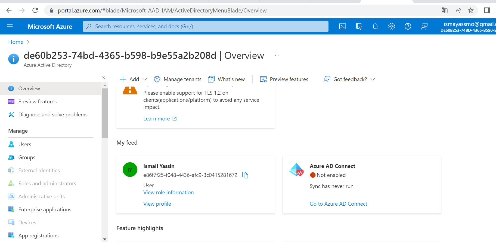
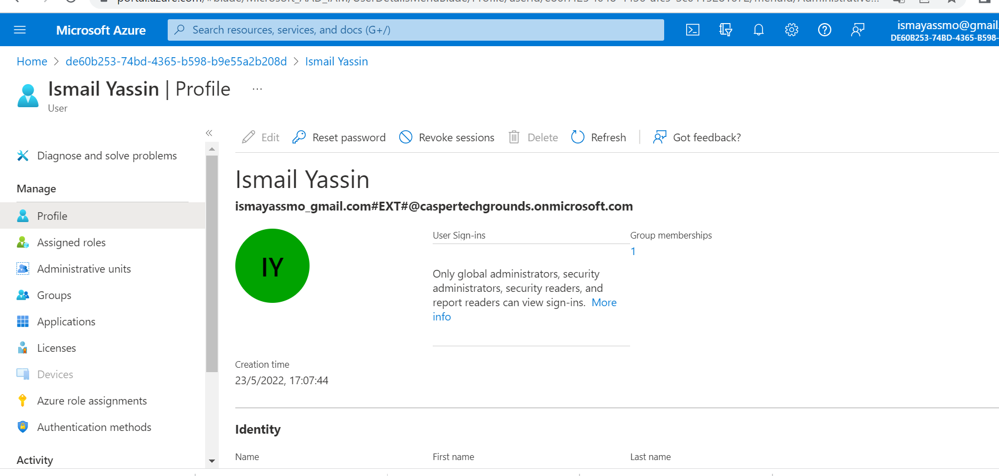
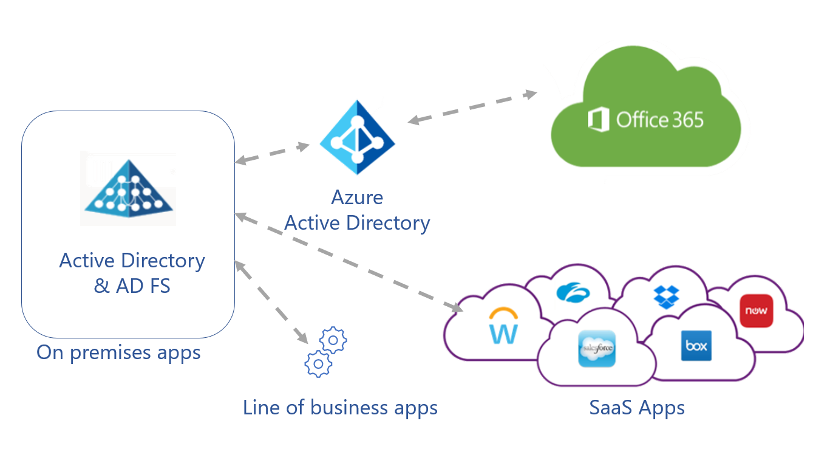

 # Azure Active Directory:

It's a cloud-based identity and access management(IAM) service.

Microsoft introduced Active Directory Domain Services in Windows 2000 to give organizations the ability to manage multiple on-premises infrastructure components and systems using a single identity per user.

Azure AD takes this approach to the next level by providing organizations with an Identity as a Service (IDaaS) solution for all their apps across cloud and on-premises.

 ### Key Terminologies:

 
 1. Identity;

An object that can get authenticated, it also includes applications or other servers that might require authentication through secret keys or certificates.

2. Account;

An identity that has data associated with it. You can't have an account without an identity.

3. Azure AD Account;

An identity created through Azure AD or another Microsoft cloud service, such as Microsoft 365. Identities are stored in Azure AD and accessible to your organization's cloud service subscriptions. This account is also sometimes called a Work or school account.

4. Azure subscription;

It's for paying the Azure cloud services. You can have many subscriptions and they're linked to a credit card.

5. Azure tenant/directory; 

A dedicated and trusted instance of Azure AD, a Tenant is automatically created when your organization signs up for a Microsoft cloud service subscription.

6. Account Administrator;

This classic subscription administrator role is conceptually the billing owner of a subscription. This role enables you to **manage all subscriptions in an account**.

7. Owner;

This role helps you **manage all Azure resources, including access**. This role is built on a newer authorization system called Azure role-based access control (Azure RBAC)

Azure AD is the underlying product providing the identity service.
The term Tenant means a single instance of Azure AD representing a single organization.

The terms **Tenant and Directory** are often **used interchangeably**.

#### Where can I find this service in the console?

In all services, then Azure Active Directory.
#### How do I enable this service?

Associate or add your subscription, then Sign in and select the subscription you want to use from the Subscriptions page in Azure portal.

Then after that you can create users and groups.

#### How can I link this service to other resources?          

1. Integrate with popular apps (Salesforce, Slack)

2. Integrate apps that rely on other identity providers;

3. Integrate on-premises applications

 # Sources:

 https://docs.microsoft.com/en-us/azure/active-directory/fundamentals/active-directory-whatis

 https://docs.microsoft.com/en-us/azure/active-directory/fundamentals/active-directory-compare-azure-ad-to-ad

 https://docs.microsoft.com/en-us/azure/active-directory/fundamentals/five-steps-to-full-application-integration-with-azure-ad
