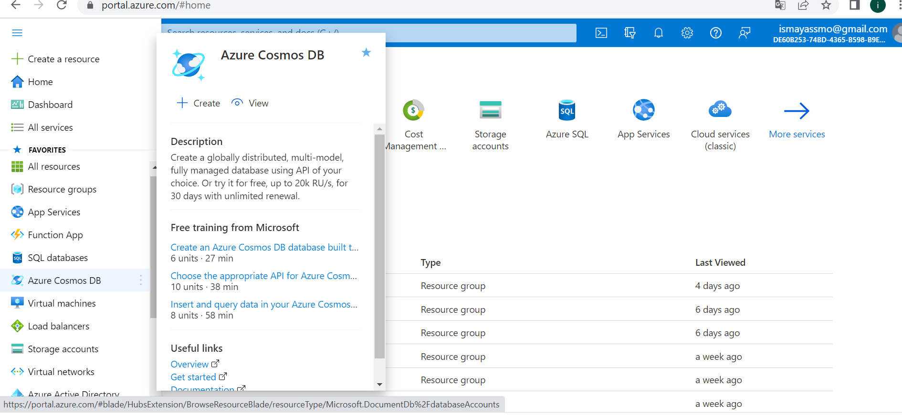
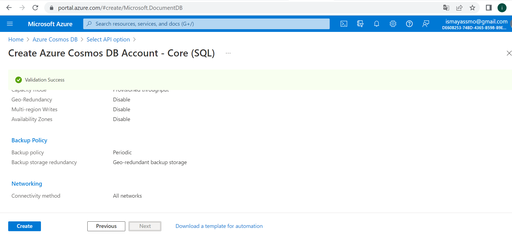
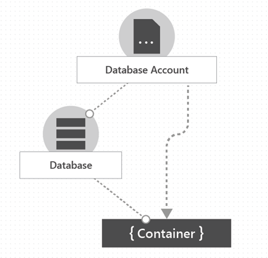
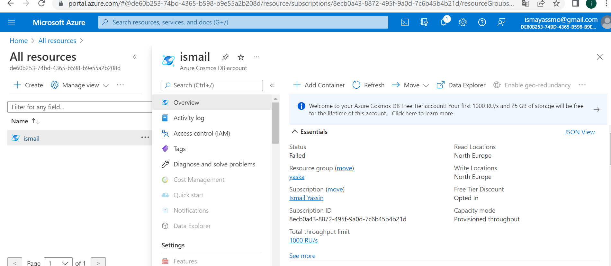

# Azure Cosmos DB:

Is a fully managed NoSQL database for app development.

Cosmos DB is designed to provide low latency, elastic throughput scalability, well-defined semantics (using no fixed SQL) for data consistency, and high availability.

Azure Cosmos DB is used within web and mobile applications and is well-suited for modeling social interactions, integrating with third-party services, and building rich personalized experiences.

### Key terminologies;

- SQL = Structured Query Language;

SQL is a domain-specific language used in programming and is designed for managing data in a relational database management system or for flow processing in a relational dataflow management system.

- NoSQL = Not Only SQL

NoSQL, also referred to as "Not Only SQL", "No-SQL", is an approach to database design that enables the storage and retrieval of data outside the traditional structures found in relational database.

***Where can I find this service in the console?***

- In the Azure portal there is a separate tab for Azure CosmosDB.

***How do I enable this service?***
- You go to Azure Cosmos DB and press Create. You choose the API according to your preference.
You can choose between Core SQL (which is recommended as it recognizes different SQLs) MongoDB, Cassandra, Azure Table and Gremlin.

***How ​​can I link this service to other resources?***

- To manage the data and provisioned throughput, you can create one or more Azure Cosmos databases under your account and within that database, you can create one or more containers.

# Sources

https://docs.microsoft.com/en-us/azure/cosmos-db/introduction

https://docs.microsoft.com/en-us/azure/cosmos-db/account-databases-containers-items

