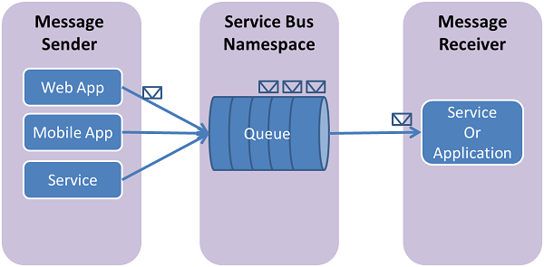

### ***Service Bus:***

Is a fully managed enterprise message broker with message queues and topics for publishing and subscription. 

The service is intended for business applications that require transactions, orders, duplicate detection, and instant consistency. 

The key scenario of this feature is that Service Bus queues or subscriptions with a low volume of messages do not need to have a receiver that polls for messages continuously.

Service Bus enables cloud-native applications to provide reliable state transition management for business processes. You use Azure Service Bus to handle high-quality messages that cannot be lost or duplicated. 

This service also facilitates highly secure communication between hybrid cloud solutions and can connect existing on-premises systems with cloud solutions.

**Service Bus has the following features:**
- Reliable asynchronous message delivery (enterprise messaging as a service) requiring polling,
- Advanced messaging features such as first-in and first-out (FIFO), batching/sessions, transactions, dead letters, temporal control, routing and filtering, and duplicate detection
- Message at least once
- Optional ordered message delivery

***Where can I find this service in the console?***

***How do I enable this service?***

First create namespace for the service bus.

***How ​​can I link this service to other resources?***

Now i created a new queue

# Sources

https://docs.microsoft.com/en-us/azure/service-bus-messaging/service-bus-to-event-grid-integration-concept?tabs=event-grid-event-schema

https://docs.microsoft.com/en-us/azure/service-bus-messaging/service-bus-quickstart-portal

