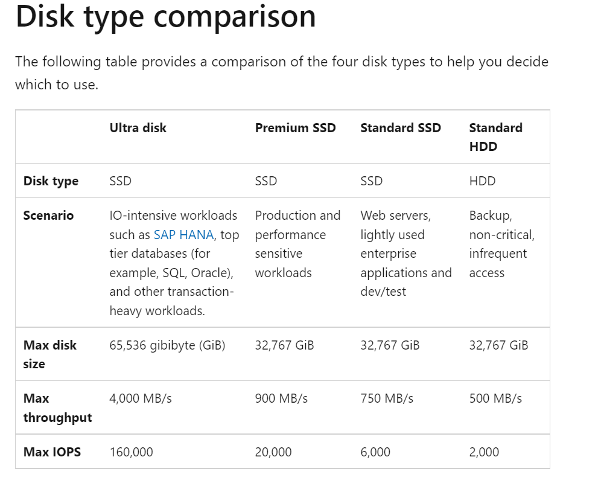
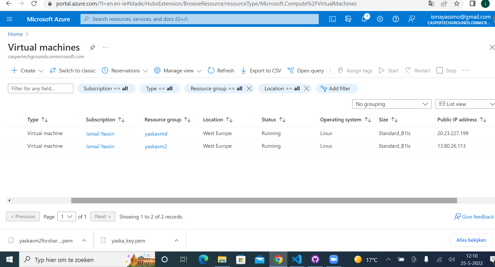
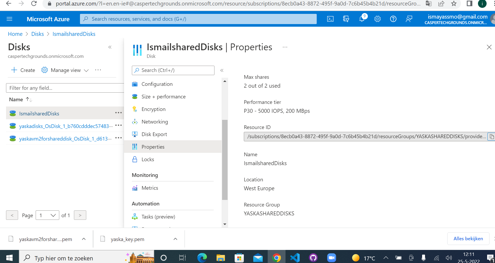
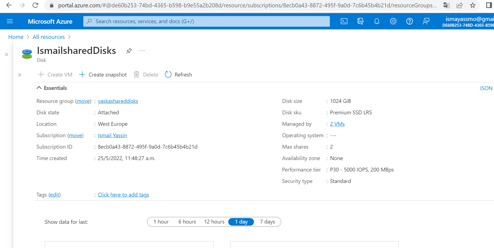
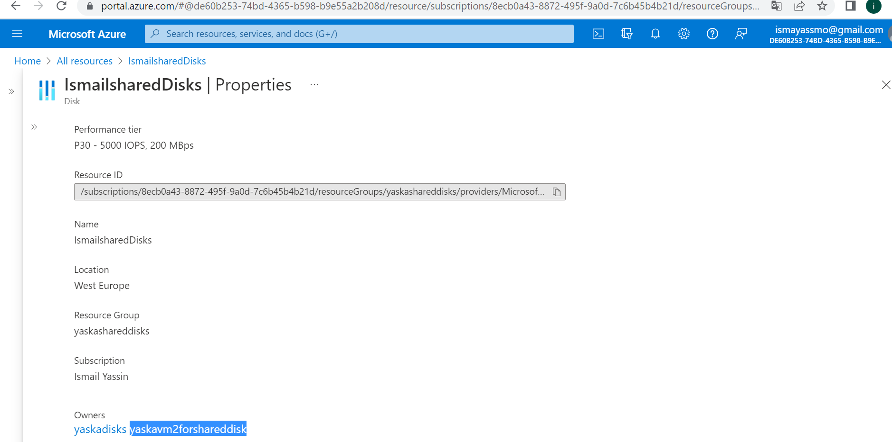
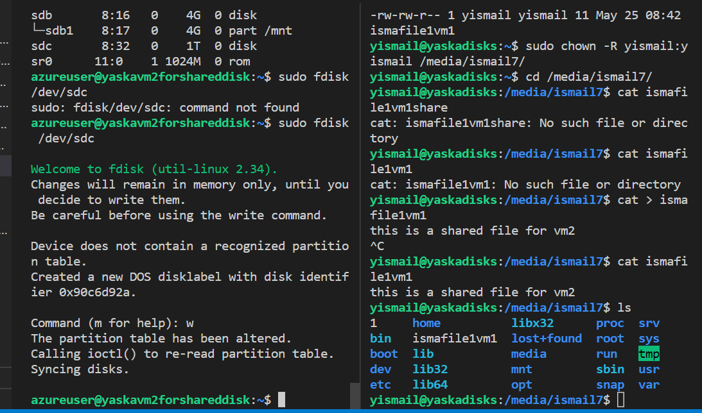
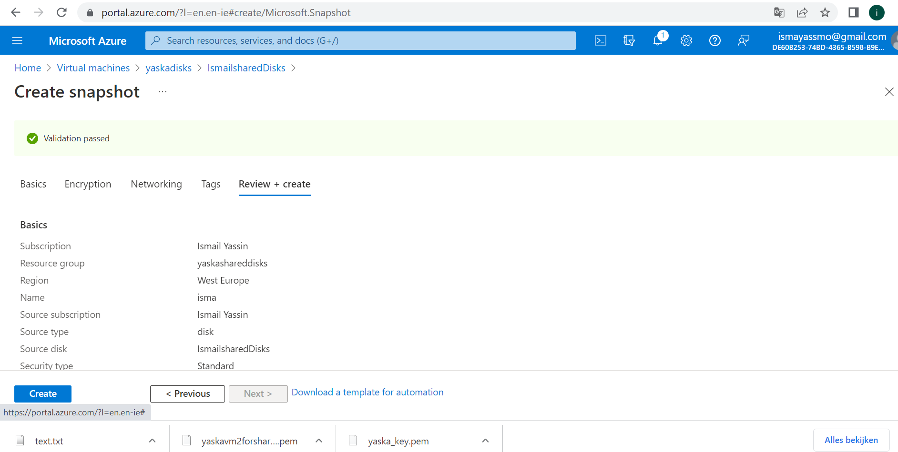
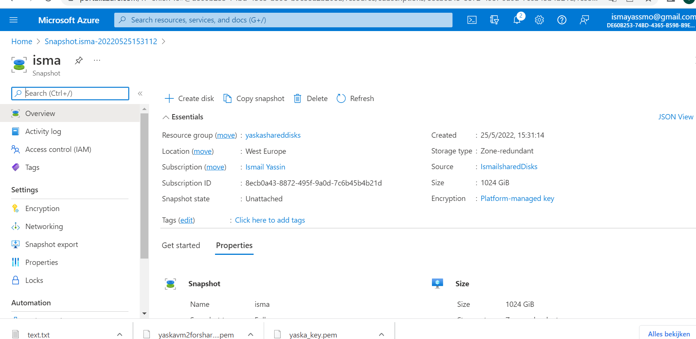

# Azure Disk Storage

Azure Disk Storage can be seen as a virtual hard drive in the cloud. 

A disk can be an OS disk (where the OS resides) or a Data Disk (similar to an external hard disk). 

 
- Unmanaged Disks;

Are cheaper, but you do need a Storage Account and you have to manage the disk yourself. 

- Managed Data Disks can be shared between multiple VMs, but that is a relatively new feature and there are some troubles found.

Backups of a Managed Disk can be made with Incremental Snapshots that only save the changes since the last snapshot. For an Unmanaged Disk you can only take a 'normal' snapshot.

There are 4 types of managed disks. In general you can say that more performance leads to higher costs:

A disk can be encrypted for security. Disks can get bigger, but not smaller.
If you want to use an external device (including a Data Disk) on Linux, you must first mount it.

### Key Terminologies:

- IOPS;
input output per sec

- Throughput;
Amount of Data that passes through( compare input and output).

- Mounting;
Attaching the filesystem of an external device(usb,hard disks) to the filesystem of a system(linux).

# Assignment:
#### Start 2 Linux VMs. Ensures you have access to both via SSH

#### Create an Azure Managed Disk and attach it to both VMs at the same time.

So to connect to the 2 vms i had to enable share disk in the disk configuration. Then I went back to VM1 and then Disk, after that I chose attach existing disk and I had to change the host caching to 'none'. Finally i chose the shared disk to attach to my vm1. Also I followed the same process for vm2 and attached to the shared disk.

#### On your first machine, create a file and place it on the Shared Disk.

#### Check on the second machine if you can read the file.

#### Take a snapshot of the disk and try to create a new Disk with it Mount this
new Disk and view the file.

# Challenges overcame
Learning about Azure Managed Disk and attaching it to 2 VMs. 

Checking on the second Vmachine if i can read the file, hich we found out it was not possible because second disk can't read the file on first disk despite being shared due to synchronization issue.

# Sources: 

https://docs.microsoft.com/en-us/azure/virtual-machines/disks-types

https://docs.microsoft.com/en-us/azure/virtual-machines/windows/attach-managed-disk-portal

https://docs.microsoft.com/en-us/azure/storage/files/storage-how-to-create-file-share?tabs=azure-portal

https://www.javatpoint.com/linux-mount

https://help.ubuntu.com/community/InstallingANewHardDrive

https://superuser.com/questions/934678/fdisk-do-i-need-it-or-can-i-make-a-filesystem-directly

https://www.howtogeek.com/443342/how-to-use-the-mkfs-command-on-linux/

https://superuser.com/questions/676093/partition-not-showing-up-in-dev

https://docs.microsoft.com/en-us/azure/virtual-machines/disks-types

https://docs.microsoft.com/nl-nl/azure/virtual-machines/managed-disks-overview