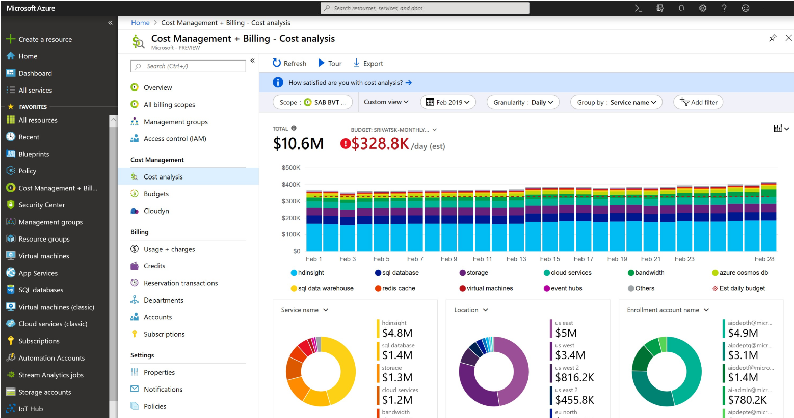
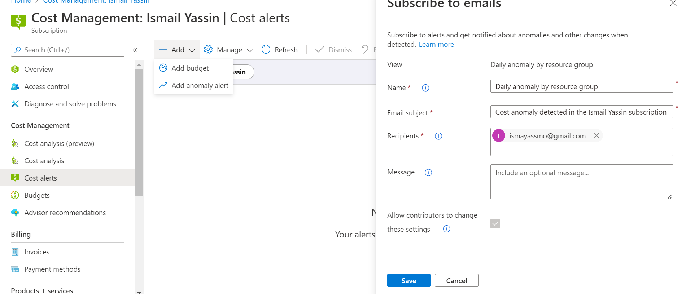

# Cost Management + Billing

#### Key Terminology:

Opex = Operational expenditure, this where you pay for what you use. Think of it like a utility bill (water&energy).

Capex = Capital expenditure, where you pay upfront, It's fixed (sunk cost).

`Pay-as-you-go` subscription;
Where you pay for what you've used.

Azure provides the following principles to successfully reduce your costs:

- Planning
- Visibility
- Accountability
- Optimization
- Iteration

The Total Cost of Ownership (TCO) is used to calculate how much an infrastructure costs when hosted in the traditional way. With the TCO calculator you can compare the costs of a traditional infrastructure with the costs for the same infrastructure on Azure.

#### Key principle and best practices on cost management:

- Understand the fundermentals of pricing

- Start early with cost optimization

- Maximize the power of flexibility

- Use the right pricing model for the job.

`Free subscription`:

# Exercise:

#### Create your own alert 

Go to 'cost management', then choose 'cost alerts' in order to create an alert. Then add anomaly alert.

#### Understand the options Azure offers to view your spend.

Azure Monitor includes functionality for the;See also photo above under cost management.

- collection and analysis of log data (billed by data ingestion, retention, and export).

- monitoring of availability via web tests, export of platform logs data from Azure resources, collection of metrics, alerts, and notifications. 

- Features of Azure Monitor that are automatically enabled such as collection of standard metrics and activity logs are provided at no cost. 

- Also available at no additional cost are the advanced monitoring capabilities that use your ingested data (see Insights and core solutions).

### Challenges overcame

Learn how to create an alert in Azure. 

### Sources:

https://azure.microsoft.com/en-us/pricing/details/monitor/

https://azure.microsoft.com/nl-nl/services/cost-management/#overview

https://spot.io/resources/azure-pricing/azure-cost-management-4-ways-to-optimize-azure-costs/