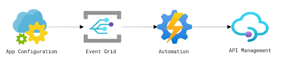

# Azure App Configuration

Enables you to centralize your app configuration. This App Configuration can manage a service that helps developers centralize their app configuration and feature settings simply and securely.

**What is Azure App Configuration for?**

It allows you to manage access to settings data. Configuration is a significant aspect of determining an application’s behavior. 

Settings files often include sensitive information like passwords and API keys. As App-Config is a fully managed service that can be set up in minutes, then you don’t have to worry about the platform where the configurations are stored.

**Azure App Configuration provides the following benefits**:

- Universal, fully managed configuration store for configuration and feature management

- Provides fast retrieval of configurations for any application in Azure, on-prem or in other clouds

- Complete data encryption, at rest or in transit

- Improve security by separating configuration from code

- Reduce configuration complexity across multiple environments

- Native integrations with popular frameworks such as .NET, Azure Functions, and Java Spring

**Why use App Configuration?**

Cloud-based applications run on multiple virtual machines or containers in multiple regions and use multiple external services. 

Therefore, Creating a robust and scalable application in a distributed environment presents a significant challenge. Various programming methodologies help developers deal with the increasing complexity of building applications.

For event driven infrastructure

**Use cases of App Configurations**

- Microservices based on Azure Kubernetes Service, Azure Service Fabric, or other containerized apps deployed in one or more geographies.

- Serverless apps, which include Azure Functions or other event-driven stateless compute apps.

- Continuous deployment pipeline.

**Combining with other services**

The easiest way to add an App Configuration store to the application is through Microsoft’s client library. Depending on the language and framework chosen, the following methods are available to connect with your application:

- For .NET Core and ASP.NET Core, used an App Configuration provider for .NET Core
- For .NET Framework and ASP.NET, App Configuration builder for .NET
- For Java Spring, App Configuration client for Spring Cloud is available.
- For Python, App Configuration client for Python.
- For JavaScript/Node.js, App Configuration client for JavaScript.
- For others, we have App Configuration REST API.

# Sources

https://docs.microsoft.com/en-us/azure/azure-app-configuration/overview

https://www.devopsschool.com/blog/what-is-azure-app-configuration/

