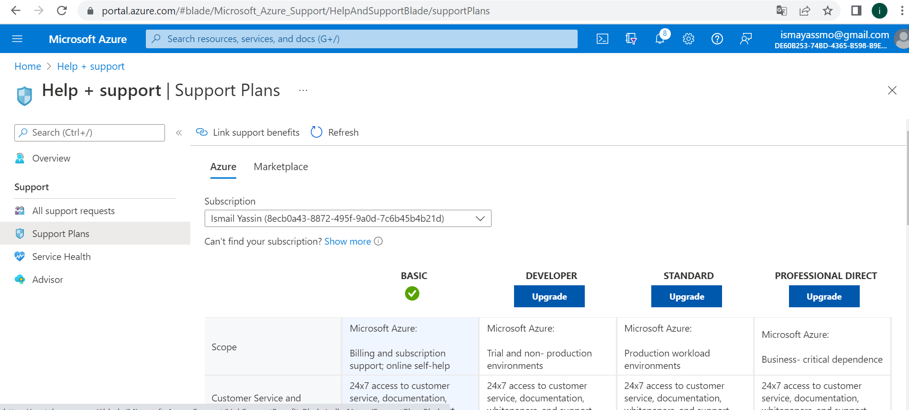

# Azure Support plans:

A support plan is a detailed document setting out what services will be provided, how they will meet customer needs, when they will be provided, and who will provide them.

**What are Support Plan for?**

Azure Support plans can be handy especially when the production environment is on the cloud which is a recipe for disaster if the underlying support is not there, thus knowing which channels of support to access can be key to the uptime of the cloud environment.

Microsoft Azure offers four support plans that can provide you with technical support:

1. Basic: 

Available to all Microsoft Azure accounts, this is the only free plan and does not have any active support from Azure, the user has access to community forums, self-help documentation, etc, and can raise as many support tickets as required.

2. Developer: 

Best suggested for **trial and non-production environments**, This plan has active support from Azure in the form of access to support engineers via email during standard Business hours. The response time from Microsoft for this plan is within **eight hours**.

3. Standard: 

Best suggested for **production workload environments**, this plan is an upgrade of the developer plan and provides support in the form of 24×7 access to support engineers via **email and phone**. The response time from Microsoft for this plan is** within one hour**.

4. Professional Direct: 

Absolutely necessary for **business-critical environments**, this plan also offers 24/7 technical support with **one-hour response time** but also includes operational support, training, and proactive guidance from a **ProDirect delivery manager**.

Here below is the support plans in my Azure account.

### Comparison

AWS support plan from free to premium which has the business and Enterprise pricing and is calculated at a percentage of AWS usage that decreases across brackets (10%-3%). so the more your AWS usage you have, the less % you'll pay.

Azure has support and pricing between Role-based support and Premier support. It comes with a price tag from free to $1000/month per user.

# Sources

https://azure.microsoft.com/en-us/support/plans/#:~:text=Microsoft%20Purview-,A%20unified%20data%20governance%20solution%20that%20maximizes%20the%20business%20value,Azure%20Chaos%20Studio

https://k21academy.com/microsoft-azure/az-900/az-900-azure-support-options/

https://kinsta.com/blog/aws-vs-azure/#support
