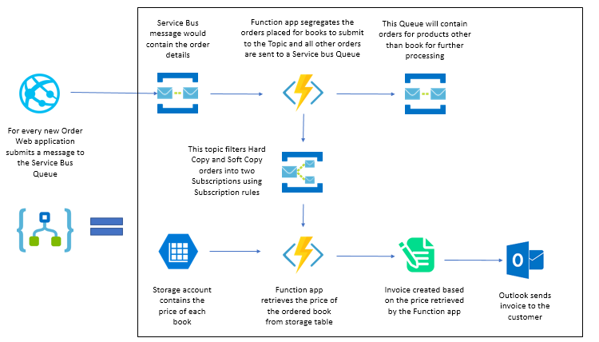
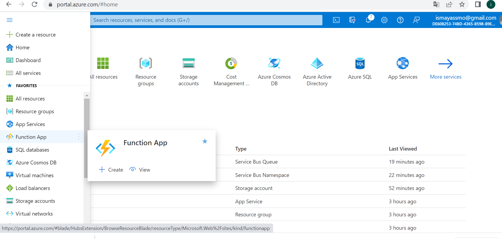
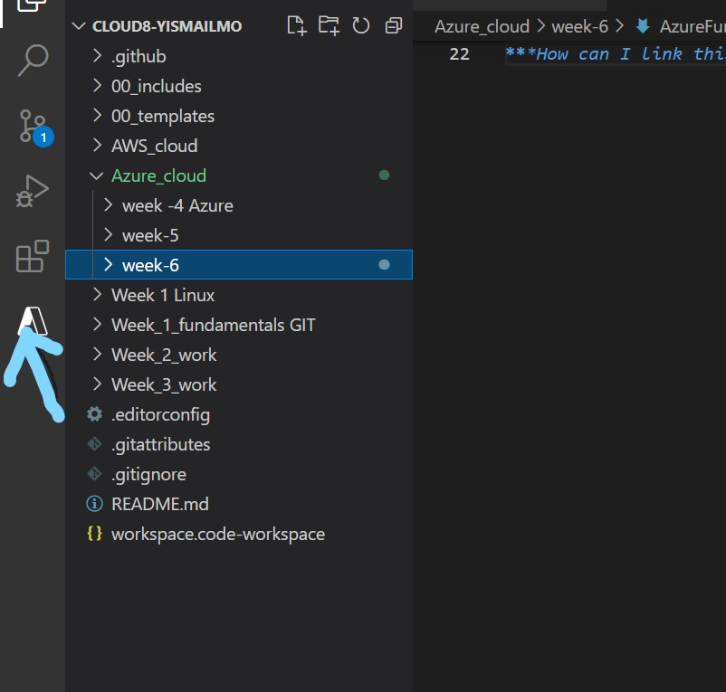
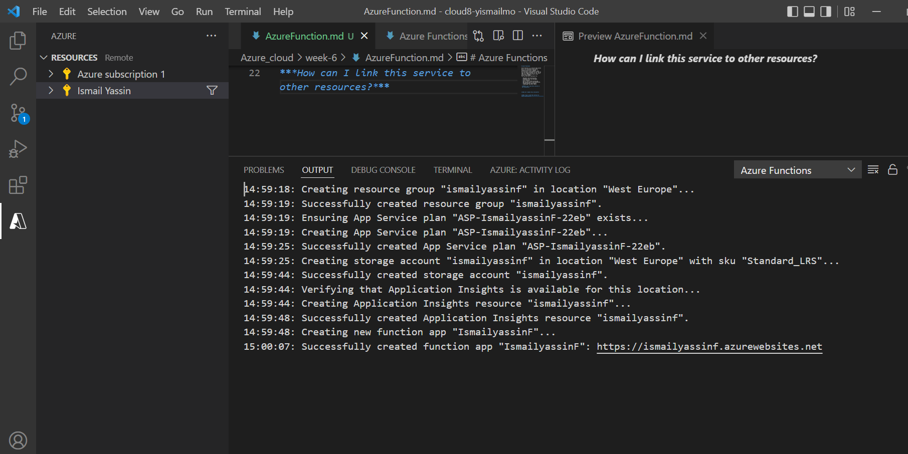
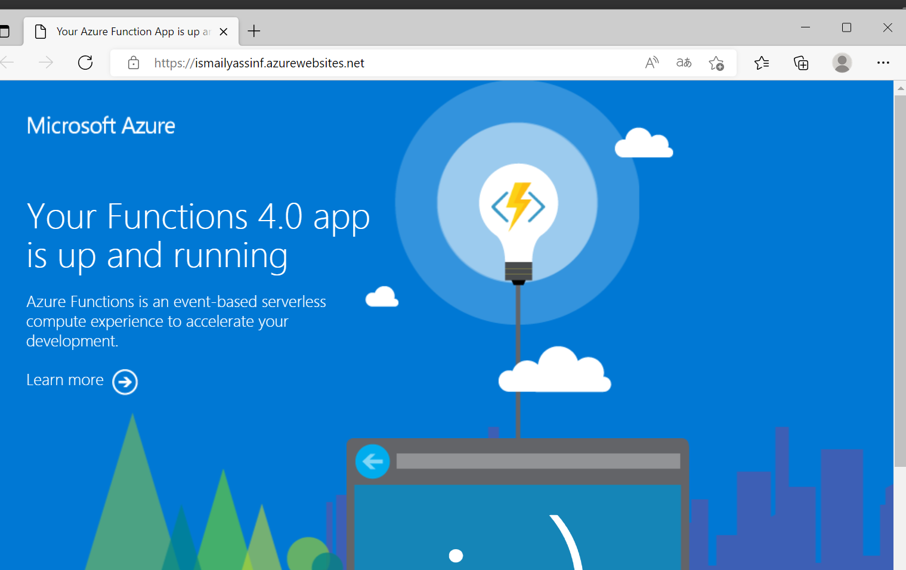
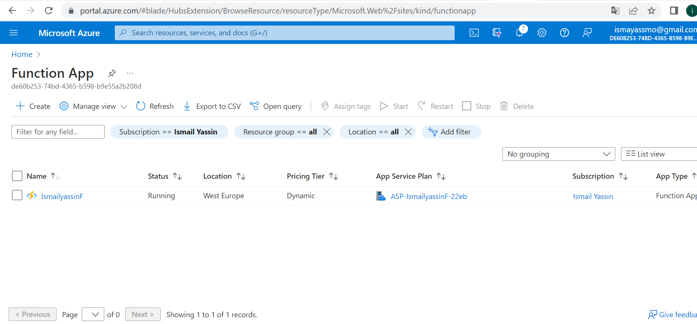
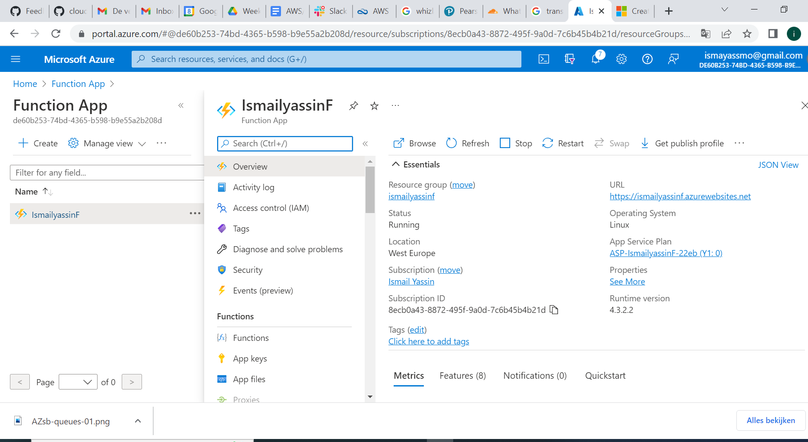

# Azure Functions

Azure Function is a service that allows you to run activated code without having to provision or manage infrastructure.

It's a serverless compute service that enables user to run event-triggered code without having to provision or manage infrastructure. 

Azure Functions can be connected to many other applications running in On-prem or on Cloud, making it a Serverless offering provides better scalability and efficiency.

You can use Azure Functions for:

 - Reminders and notifications.
 - Scheduled tasks and messages.
 - File handling.
 - Database cleanup.
 - Data or data stream processing.
 - Run backup tasks in the background.
 - Making backend calculations.
 - Lightweight web APIs (MVPs).

### Key terminologies:

- trigger-based service;

Running a script or piece of code in response to a variety of events.

### Advantages of using Azure Function:

1. Pay as you go model- Azure Functions comes in the Pay as you go model. User can pay only for what they use. For Azure functions, cost is based on the Number of Executions per month. 

2. Supports variety of Languages- Azure Function supports major languages like Java, C#, F#, Python and more. Refer above to know more about Azure Functions supported languages.

3. Easy Integration with Other Azure services – Azure Functions can be easily integrated with the other Azure Services like Azure Service bus, Event Hubs, Event Grids, Notification Hubs and more without any hassle.

4. Trigger based executions Azure Functions get executed based on the configured triggers. It supports various triggers like HTTP Triggers, Queue Trigger, Event Hub Trigger and more. Being as a trigger-based service, it run on demand. Refer the Trigger section above to know more about the available triggers.

 ***Where can I find this service in the console?***

Location in Azure portal

location in VScode

Download the Azure Function extension, then you will see the Azure function;

 
***How do I enable this service?***

Sign in to the Azure in VScode for Azure function under resources;

Function is up and running;

***How ​​can I link this service to other resources?***

it  usually depends on what you'd like to use it for, e.g. Scheduled Tasks, Reminders, Notifications, and Lightweight Web API are examples of how to use Functions. You choose your preferred programming language and create a function. Via the Azure portal you can review what you have created and published to the Azure Portal.

# Sources

https://docs.microsoft.com/en-us/azure/azure-functions/functions-overview

https://docs.microsoft.com/en-us/azure/azure-functions/create-first-function-vs-code-python

https://www.serverless360.com/azure-functions

