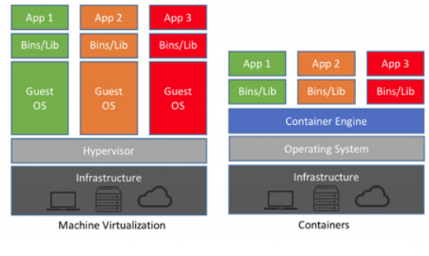
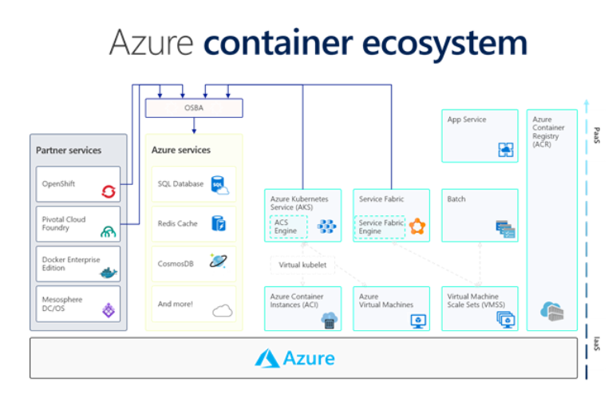

# Containers

Containers wrap an application and all of its dependencies, such as libraries and configuration files, into its own isolated 'box' that contains everything needed to run the software inside the container.

Wherever the container runs, the application inside it always has everything it needs to run such as the right versions of its dependent libraries, any configuration files, and anything else it needs to run.

### Key terminologies:

**Azure Container Instances**;

Is a service that enables a developer to deploy containers on the Microsoft Azure public cloud without having to provision or manage any underlying infrastructure.

**Container groups**: A developer can schedule multiple containers to deploy as a group that shares the same host machine, storage, network and other resources.

For example, a container group could include one application container, and then one logging or monitoring container.

**Azure Kubernetes Service (AKS)**;

A managed container orchestration service built on the open source Kubernetes system. 

**Persistent storage**; 

Container instances are stateless by default, but an organization can choose to mount an Azure file share to a container to enable persistent storage.

**What are containers for?**

1. Lift and shift: You can put an existing application in a container instead of migrating it. These applications depend on Internet Information Services (IIS). You can package these applications into container images from the precreated IIS image and deploy them.

2. Use an existing container image for part of your application:

For example, you might use the NGINX container for the web front end of your application and stateful services for the more intensive back-end computation.

3. Reduce impact of "noisy neighbors" services: 

If services might consume many resources and affect the performance of others (such as a long-running, query-like operation), consider putting these services into containers that have resource governance.

**How does  containers / replace  containers in a classic setting?**

VM needs to be provisioned and managed, while  Azure Container Instances can start containers in Azure in seconds.

Machine virtualization vs containers is highlighted in the photo below.

The following use cases are especially suitable for running containers in the cloud:

-   Microservices—containers are lightweight, making them well suited for applications with microservices architectures consisting of a large number of loosely coupled, independently deployable services.

-   DevOps—many DevOps teams build applications using a microservices architecture, and deploy services using containers. Containers can also be used to deploy and scale the DevOps infrastructure itself, such CI/CD tools.

-   Hybrid and multi-cloud—for organizations operating in two or more cloud environments, containers are highly useful for migrating workloads. They are a standardized unit that can be flexibly moved between on-premise data centers and any public cloud.

**How can I combine containers with other services?**

Containers provide many benefits to cloud-native applications, including portability. In the Azure cloud, you can deploy the same containerized services across staging and production environments. Azure provides several options for hosting these containerized workloads:

- Azure Kubernetes Services (AKS)
- Azure Container Instance (ACI)
- Azure Web Apps for Containers

Web app for containers allows you to run your custom docker image in Azure App Service and take advantage of the managed platform service. 

#### Comparison

Amazon Elastic Container Service (ECS) can be used to host container services either in a self-managed cluster of EC2 instances or on a serverless infrastructure managed by Fargate.

Google Kubernetes Engine (GKE) is the managed Kubernetes service from GCP that can be used to host highly available and scalable container workloads.

# Sources

https://azure.microsoft.com/en-us/overview/what-is-a-container/#overview

https://docs.microsoft.com/en-us/azure/service-fabric/service-fabric-containers-overview

https://www.techtarget.com/searchcloudcomputing/definition/Azure-Container-Instances

https://www.silversands.co.uk/blog/understanding-containers-azure/

https://codersociety.com/blog/articles/container-workloads-aws-azure-gcp