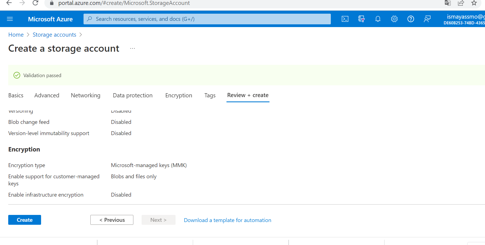
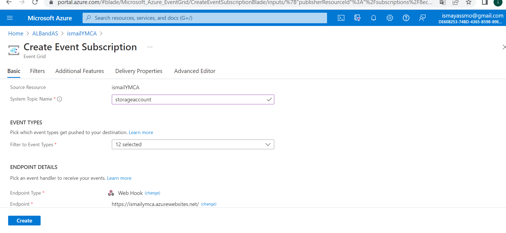
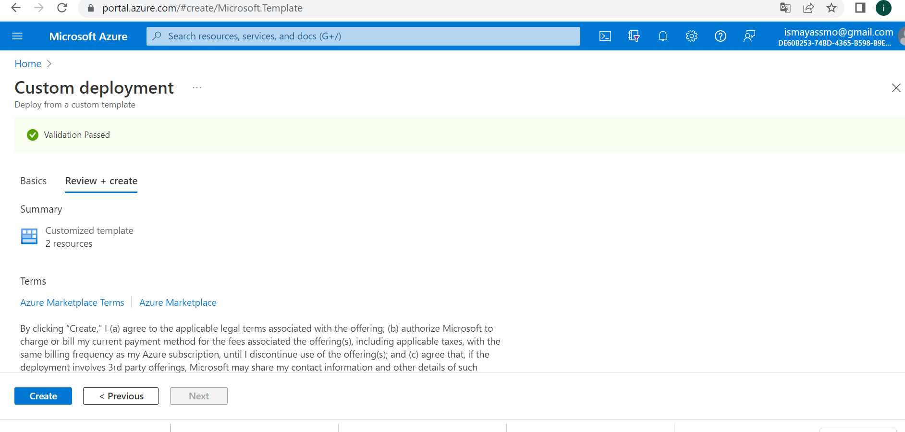
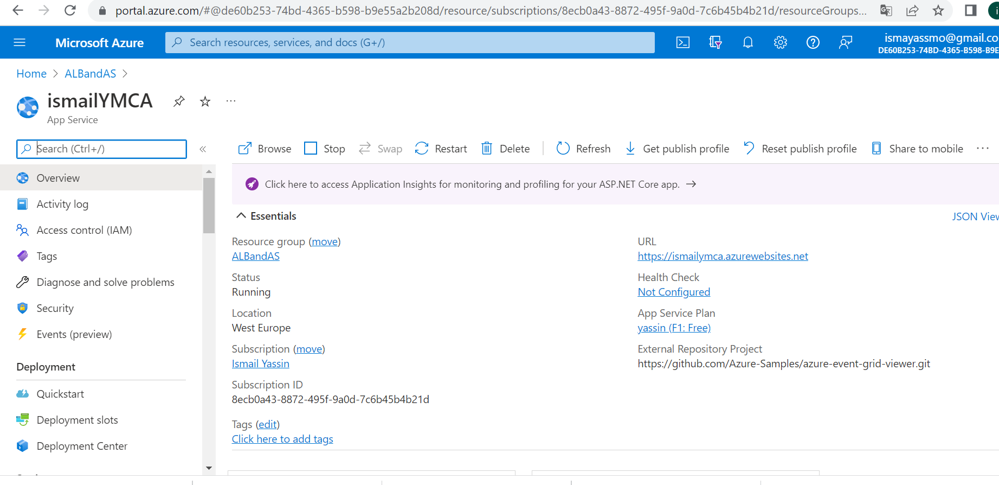
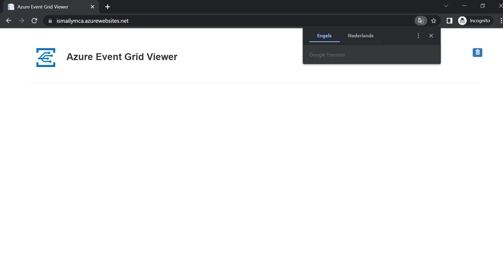
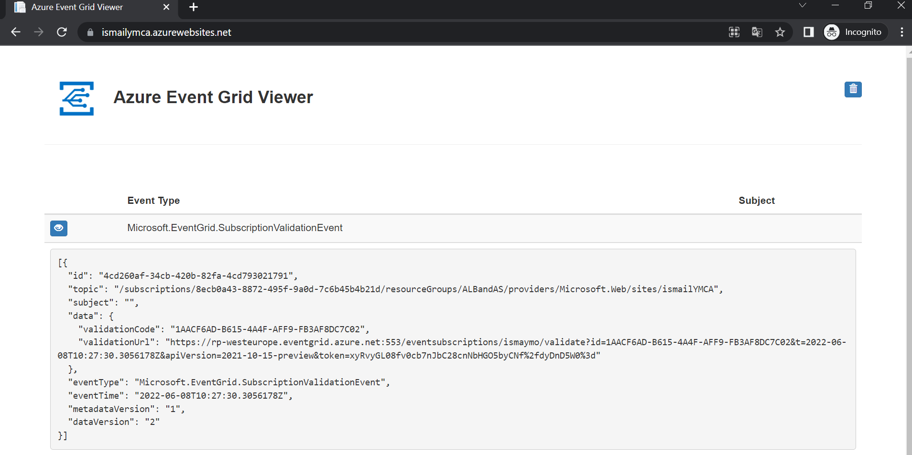

# Event Grid

Azure Event Grid is an event broker used to integrate workloads that use event-driven architectures.

Allows you to easily build applications with event-based architectures. First, select the Azure resource you would like to subscribe to, and then give the event handler or WebHook endpoint to send the event to.

The Event Grid below shows connecting event sources and event handlers.

Event Grid is deeply integrated with Azure services and integrates with third-party services. It simplifies event consumption and reduces costs by eliminating the need for constant pollen. 

Event Grid efficiently and reliably routes events from Azure and non-Azure resources. It distributes the events to registered subscriber endpoints. The event message contains the information you need to respond to changes in services and applications. Event Grid is not a data pipeline and does not provide the actual object that was updated.

#### Key terminologies:

- Event;

An event is a lightweight notification of a condition or a state change. The publisher of the event has no expectation about how the event is handled. The consumer of the event decides what to do with the notification.

- Event handler;

An event handler is the place where the event is sent. The handler takes some further action to process the event. 

- Event source;

The event source is the name of the software that logs the event. It is often the name of the application or the name of a subcomponent of the application if the application is large. 

**Event Grid has the following features:**

- Dynamically scalable
- Low costs
- Serverless
- Delivering an event at least once

***Where can I find this service in the console?***

first create a storage account(you will this in all resources), then create create the endpoint for the event message .

***How do I enable this service?***

Deploy to Azure to deploy the solution to your subscription.

***How ​​can I link this service to other resources?***

Then open the link  On the App Service page for my web app (https://ismailymca.azurewebsites.net/), select the URL to navigate to the web site. 

see the site but no events have been posted to it yet.

Then  finally I enabled the Event Grid resource provider.

Now see my web app again, and notice that a subscription validation event has been sent to it(when i Select the eye icon to expand the event data). 

Event Grid sends the validation event so the endpoint can verify that it wants to receive event data.

# Sources

https://docs.microsoft.com/en-us/azure/event-grid/overview

https://docs.microsoft.com/en-us/azure/event-grid/event-handlers

https://docs.microsoft.com/en-us/azure/event-grid/blob-event-quickstart-portal

