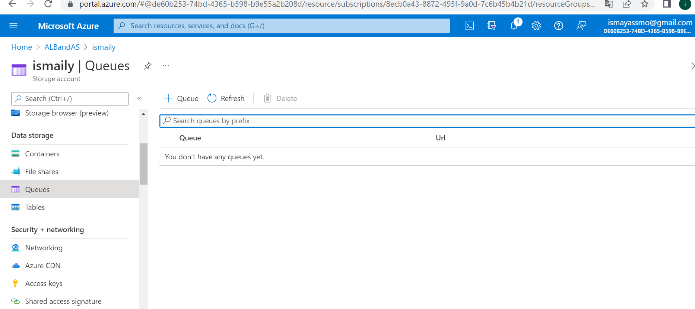
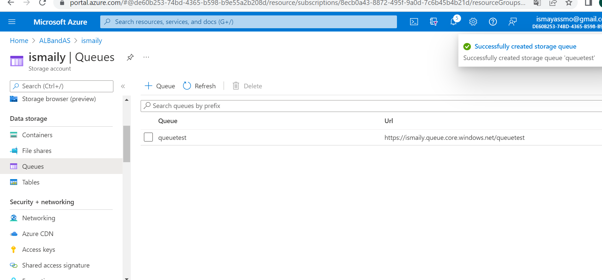
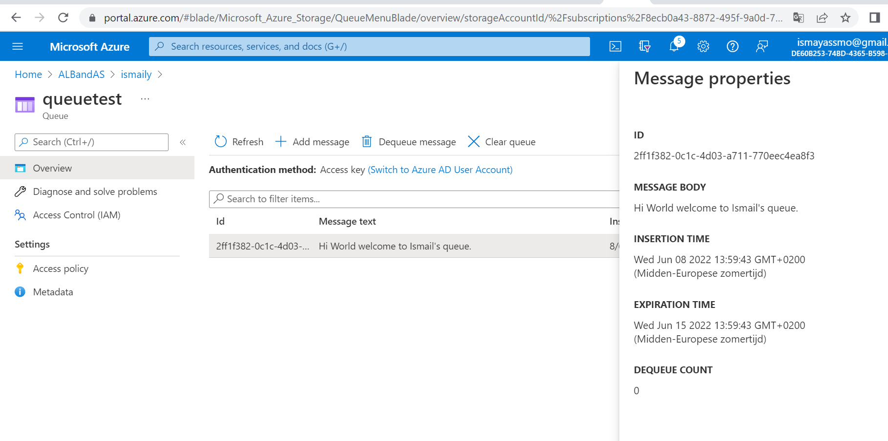
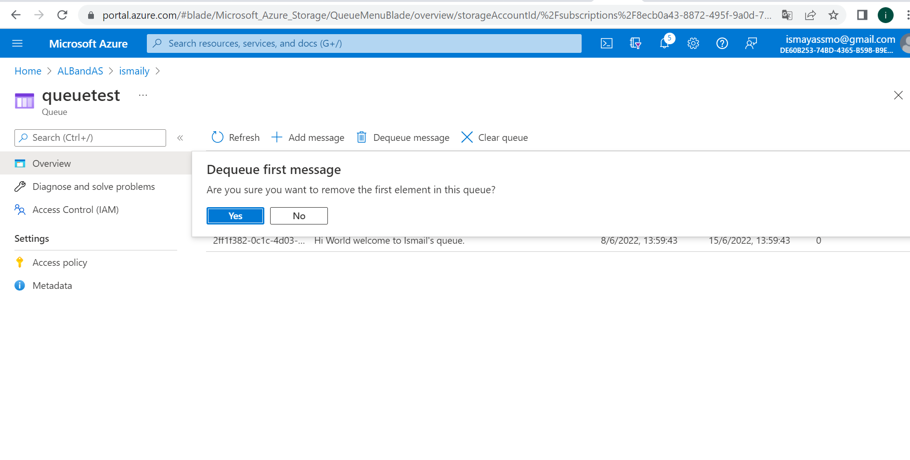

### ***Queue Storage:***

Azure Queue Storage is one of the supported event handlers. Queue storage is a service for storing large numbers of messages. 

You can access messages from anywhere in the world via authenticated calls using HTTP or HTTPS.

Queue Storage can be used to receive events that need to be retrieved. You can use Queue Storage if you have a long running process that is taking too long to respond. Sending events to Queue storage allows the app to fetch and process events on its own schedule.

**Queue Storage has the following features:**
- Simple, cost-effective, durable message queue for large workloads
- Data accessible through the REST (Representational state) API
- Extensive client libraries for .NET, Java, Android, C++, Node.js, PHP, Ruby and Python
- the maximum allowed lifespan is seven days and allowed size of 64Kb.

***Where can I find this service in the console?***

In the storage account under data storage.

***How do I enable this service?***

***How ​​can I link this service to other resources?***

View message properties;

Dequeue the message;

# Sources

https://docs.microsoft.com/en-us/azure/storage/queues/storage-quickstart-queues-portal
