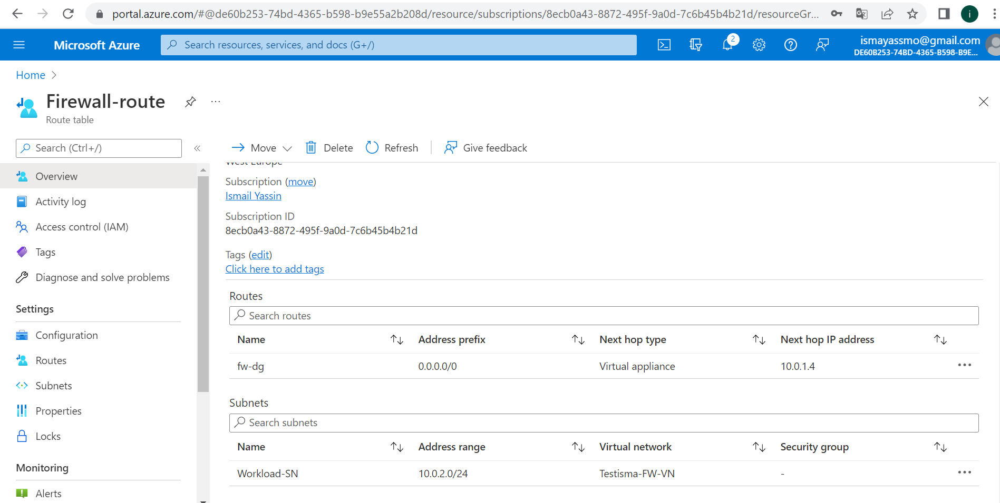

# Azure Firewall

Azure Firewalls can protect VNets from the intended and unintended malicious traffic.

You can use the Firewall in different configurations in a subnet, or in a hub-and-spoke network. 

A Firewall has always a public IP address to which all incoming traffic should be sent. And a private IP address where all outgoing traffic has to go.

### Key terminology:

- stateless firewall;

It uses clues from the destination address, source and other key values to assess whether threats are present, then block or restrict those deemed untrusted. 

Preset rules enforce whether traffic is permitted or denied, but the system is typically unable to determine the difference between truly desired communications and sophisticated attempts to disguise unauthorized communications as trusted ones.

- Stateful firewall; 

Stateful firewalls are capable of monitoring and detecting states of all traffic on a network to track and defend based on traffic patterns and flows. Stateless firewalls, however, only focus on individual packets, using preset rules to filter traffic.

Azure Firewall is a stateful firewall.

Study:
#### The difference between Basic and Premium Firewall

1. Azure Firewall Standard (basic);

Is a managed, cloud-based network security service that protects your Azure Virtual Network resources.

2. Azure Firewall Premium;

provides advanced threat protection that meets the needs of highly sensitive and regulated environments, such as the payment and healthcare industries.

Azure Firewall Premium includes the following features:

- TLS inspection - decrypts outbound traffic, processes the data, then encrypts the data and sends it to the destination.
- IDPS - A network intrusion detection and prevention system (IDPS) allows you to monitor network activities for malicious activity, log information about this activity, report it, and optionally attempt to block it.
- URL filtering - extends Azure Firewall’s FQDN filtering capability to consider an entire URL.
- Web categories - administrators can allow or deny user access to website categories such as gambling websites, social media websites, and others.

#### The difference between a Firewall and a Firewall policy (Firewall Policy);

Azure Firewall;

Is a cloud-native and intelligent network firewall security service that provides the best of breed threat protection for your cloud workloads running in Azure.

Firewall Policy;

Is the recommended method to configure your Azure Firewall. It's a global resource that can be used across multiple Azure Firewall instances in Secured Virtual Hubs and Hub Virtual Networks. Policies work across regions and subscriptions.

# Assignment:

#### Turn on a web server. Make sure the ports for both SSH and HTTP are open.

#### Create an Azure Firewall in VNET. Make sure that your web server is still reachable via HTTP, but that SSH is blocked.

#### Challenges overcame:
setting up webserver via htttp and blocking ssh, so i had to allow http in the NAT rule.

# Sources

https://docs.microsoft.com/en-us/azure/firewall-manager/

https://docs.microsoft.com/en-us/azure/firewall/tutorial-firewall-deploy-portal

