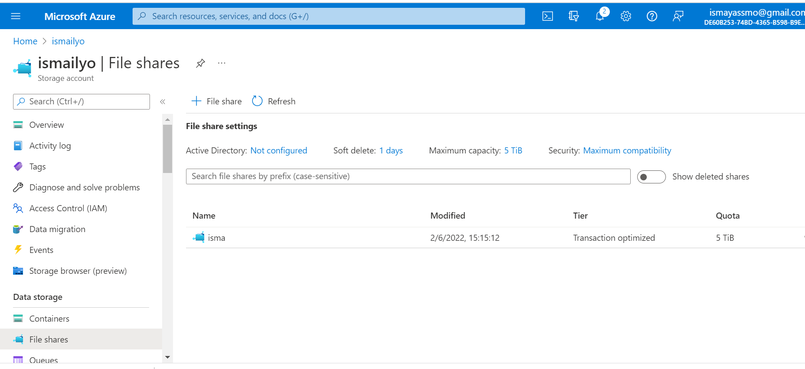

# Files:

13.4 Azure Files

    -   Where can I find this service in the console?
        
        - You can find Azure File share under a tab in your Storage account. See below picture.

        
        
       

    -   How do I enable this service?

         -  You can use Azure Files when you have created a Storage account. 
        The storage account is already active, but there is nothing on it. Azure Documentation expalined that, Azure Files is really put into use when I upload a file in it.
        Below I have an example. I have uploaded a file in Azure Files share. 

      

    -   How can I link this service to other resources?

        -  You can link your file share to different services. You can share the file and connect to your current OS. For example, on-premises machines, which can import and use the files. You can also connect the File share to a VM, which is made accessible via a private endpoint and can then be connected to the location that needs access. The configurations must be fine-tuned, which ensures that the files are available from both endpoints. Finally you can also connect it to the storage account.  

2. Azure Database (+ managed instance):

    Azure SQL Database is a fully managed platform as a service (PaaS) database engine that handles most of the database management functions such as upgrading, patching, backups, and monitoring without user involvement. Azure SQL Database is always running on the latest stable version of the SQL Server database engine and patched OS with 99.99% availability.

    It enables you to process both relational data and non-relational structures, such as graphs, JSON, spatial, and XML.

    A SQL Managed Instance is created in its own VNet with no public endpoint. To access client applications, you can create a virtual machine in the same VNet (with a different subnet) with a point-to-site VPN connection to the VNet from the client computer using one of these quickstarts:

- Enable public endpoint on your SQL Managed Instance to access your data directly from your environment.
- Create Azure Virtual Machine in the SQL Managed Instance VNet for client application connectivity, including SQL Server Management Studio.
- Set up a point-to-site VPN connection to your SQL Managed Instance from your client computer running SQL Server Management Studio and other client connection applications. This is one of two other options for connectivity to your SQL Managed Instance and its VNet. The other option is to use an express route over a site-to-site connection from your local network.

    -   Where can I find this service in the console?

        -   Via Azure SQL, kan je kiezen om een Managed Instance aan te maken.  

    -   How do I enable this service?

    -   How can I link this service to other resources?

 

https://docs.microsoft.com/en-us/azure/storage/files/storage-files-introduction

https://docs.microsoft.com/en-us/azure/storage/files/storage-files-quick-create-use-windows

https://docs.microsoft.com/en-us/azure/azure-sql/database/sql-database-paas-overview?view=azuresql
