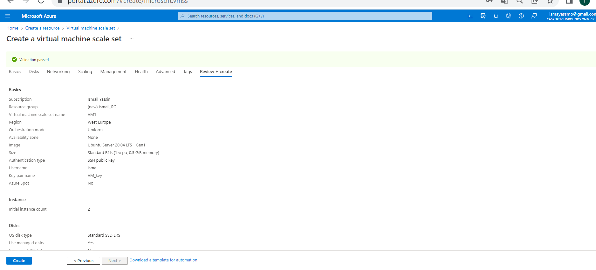

# Azure Load Balancer (ALB) & Auto Scaling

**Auto Scaling**:

Makes it  possible for you to scale up and down with on-demand services and don't have to guess how much capacity you need.

When running applications with a spiky workload, you can create a VM Scale Set instead of a single server. When the demand for the application is high, Auto Scaling can automatically add VMs to your Scale Set. When the demand goes down, it can also remove instances again.

So, you control what metrics to monitor, such as CPU or memory, how long the application load must meet a given threshold, and how many VM instances to add to the scale set.

To ensure that all VMs are the same, you must designate an image when configuring a VM Scale Set. You can modify this image later with the reimage option. Auto Scaling uses Azure Monitor to determine whether to add or remove VMs.

**Types of autoscaling**:

1. Time-Based autoscaling;

Is a scaling based on the scheduled time. This type needs some extent of manual prediction of your demand. For example, suppose you know that your application experiences high traffic during certain times of the day, week or month and the number of virtual machines needed to meet that demand. In that case, you can configure the rules to spin up and shut down those needed virtual machines only during that specific time period.

2. Metrics-Based Autoscaling; 

It enables the scaling activity to be based on the key performance metrics of your resource like CPU, Memory, Thread Count, etc.

**Predictive Autoscaling**:

It uses predictive analytics, including historical usage data and recent usage trends, to automatically scale based on predictions about future usage. Predictive autoscaling is especially useful for:

-   Detect large, impending spikes in demand and prepare capacity ahead of time
-   Dealing with large-scale, regional disruptions
-   Provides greater flexibility in scaling in or out to respond to variable traffic patterns throughout the day.

**Scheduled Autoscaling**:

Scheduled Autoscaling is a kind of hybrid approach to policy scaling that still functions in real time, but also anticipates known changes in traffic load and executes policy responses to those changes at specific times. Scheduled scaling works best in cases where traffic is known to decrease or increase at certain times of the day, but the changes in question are usually very sudden. Scheduled scaling keeps groups with autoscaling ready to respond quickly during critical times with extra capacity.

**Load Balancer**:

Load balancing refers to evenly distributing load (incoming network traffic) across a group of backend resources or servers.

Azure Load Balancer operates at layer 4 of the Open Systems Interconnection (OSI) model. It's the single point of contact for clients. Load balancer distributes inbound flows that arrive at the load balancer's front end to backend pool instances. 

In a traditional architecture, a client connects to a single server with a single public IP address. When you have a fleet of servers, this no longer works. That is why you can use a load balancer as an endpoint for the client. The load balancer will forward the request to one of the servers in your fleet and send the response back to the client.

- A public load balancer can provide outbound connections for virtual machines (VMs) inside your virtual network. These connections are accomplished by translating their private IP addresses to public IP addresses. Public Load Balancers are used to load balance internet traffic to your VMs.

- An internal (or private) load balancer is used where private IPs are needed at the frontend only. Internal load balancers are used to load balance traffic inside a virtual network. A load balancer frontend can be accessed from an on-premises network in a hybrid scenario.

**Azure has two managed solutions for load balancing to a fleet of servers**:

1. Azure Load Balancer: 

You get this for free with a VM Scale Set. The ALB operates on layer 4 of the OSI stack (TCP/UDP). An ALB can only route to Azure resources.

2. Application Gateway: 

This load balancer operates on layer 7 of the OSI stack (HTTP/HTTPS). It also has support for SSL termination and Web Application Firewall (WAF) features, among other things. An Application Gateway can route to any routable IP address.

### Secure by default:

1. Standard load balancer is built on the zero trust network security model.

2. Standard Load Balancer is secure by default and part of your virtual network. The virtual network is a private and isolated network.

3. Standard load balancers and standard public IP addresses are closed to inbound connections unless opened by Network Security Groups.

4. Basic load balancer is open to the internet by default.

5. Load balancer doesn't store customer data.

**Pricing For Load Balancer**

- Basic Load balancer: Free and no SLA
- Standard version Load balancer: 0,024/hour per 5 rules
- Gateway Load balancer: 0,012/hour
### Task 1:

**Create a Virtual Machine Scale Set with the following requirements**:

- Ubuntu Server 20.04 LTS - Gen1
- Size: Standard_B1ls
- Allowed inbound ports:
- SSH (22)
- HTTP (80)
- OS Disk type: Standard SSD
- Networking: defaults
- Boot diagnostics are not necessary
- custom data:

        #!/bin/bash
        sudo su
        apt update
        apt install apache2 -y
        ufw allow 'Apache'
        systemctl enable apache2
        systemctl restart apache2

- Initial Instance Count: 2
- Scaling Policy: Custom

- Number of VMs: minimum 1 and maximum 4
- Add a VM at 75% CPU usage
- Delete a VM at 30% CPU usage

### Task 2:
**Check whether you can reach the web server via the endpoint of your load balancer.
Run a load test on your server(s) to enable auto scaling. There may be a delay in creating new VMs, depending on the settings in your VM Scale Set**.

After low traffic and running my weberver, the second VM is deleted. Also the stress test is done for the cpu of the VM by running **sudo apt-get install stress** and play around with the cpu capacity.

By using the following command (first installing **sudo apt install stress-ng**) to test whether extra vms will be added when the load increases in 1 vm.

### Challenges overcame

Could not do the load test in azure portal so I used **stress-ng** command in CLI to add an extra load to the VM and in that way i could see the extra VM being created. 

# Sources

https://docs.microsoft.com/en-us/azure/load-balancer/load-balancer-overview

https://docs.microsoft.com/en-us/azure/virtual-machine-scale-sets/virtual-machine-scale-sets-autoscale-overview

https://azure.microsoft.com/nl-nl/pricing/details/load-balancer/

https://www.red-gate.com/simple-talk/cloud/azure/autoscaling-in-microsoft-azure/

https://stackoverflow.com/questions/55241569/azure-auto-scaling

https://www.tecmint.com/linux-cpu-load-stress-test-with-stress-ng-tool