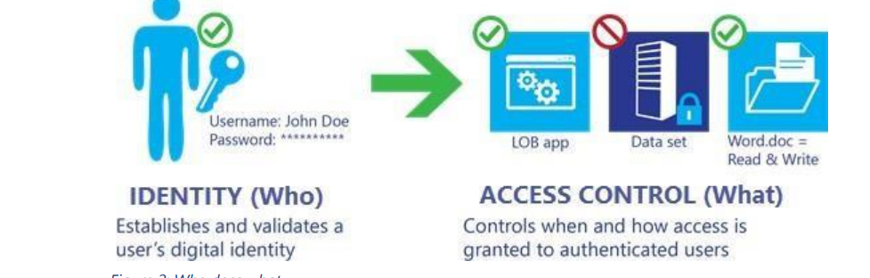
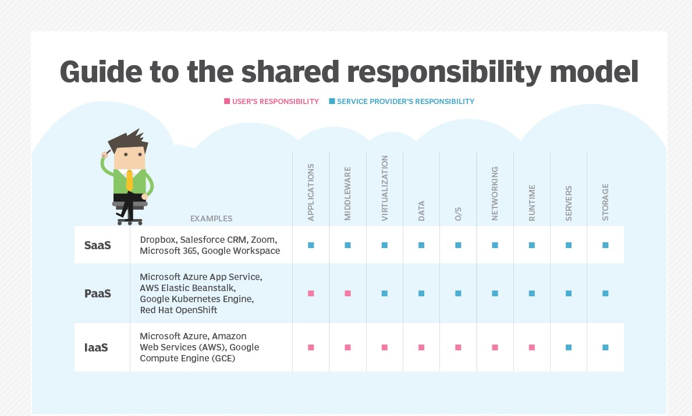
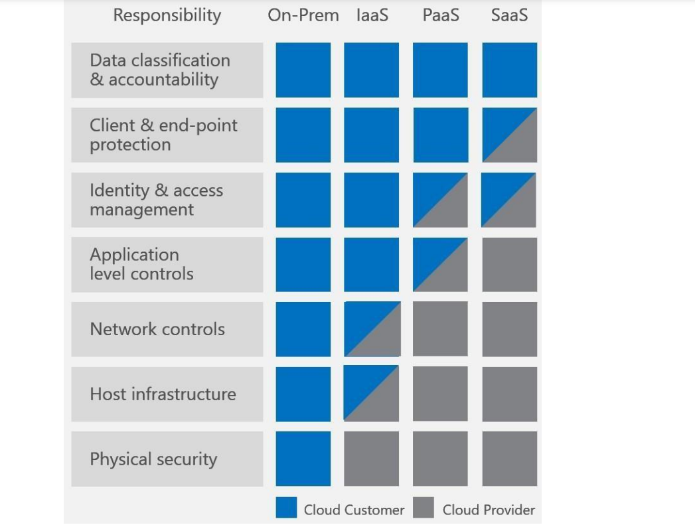

# Shared Responsibility Model

The shared responsibility model is about clearly defining the responsibilities of cloud solution provider(CSP) and the customer, and what services the CSP and customer are both responsible for (like encryption).

In the cloud many of the responsibilities from physical security of the data center to the security and encryption of your data, but also the maintenance and management of the building are taken over by the cloud solution provider(CSP).

Defining the line between customer responsibilities and those of the Cloud service providers(CSP) is imperative for reducing the risk in the public, hybrid, and multi-cloud environments.

So as a customer you can rent the infrastructure without having to worry about physical network infrastructure.

However, as a customer, you are still responsibile for access control to data and software, encryption of data at rest and data in transit.

Therefore CSP (Azure) manages security of the cloud like:

- Database (ensuring effective functionality of underlying infrastructure)
- Networking control configuration (network infrastructure )
- Global infrastructure (regions,AZ, region pairs) physical security

While security in the cloud is the responsibility of the customer like:

- Data to servers
- Turn on encryption
- multi-factor authentication is up to the customer

The Cloud solution provider(CSP) offers extra services with which one can manage their own responsibilities more easily.

In a shared responsibility model, a layered approach to security is illustrated as:

• For on-premises solutions, the customer is both accountable and responsible for all aspects of security and operations.

• For IaaS solutions, the elements such as buildings, servers, networking hardware, and the hypervisor should be managed by the Cloud service provider(CSP). The customer is responsible or has a shared responsibility for securing and managing the operating system, network configuration, applications, identity, clients, and data.

• PaaS solutions build on IaaS deployments, and the provider is additionally responsible to manage and secure the network controls. The customer is still responsible or has a shared responsibility for securing and managing applications, identity, clients, and data.

• For SaaS solutions, a CSP provides the application and abstracts customers from the underlying components. Nonetheless, the customer continues to be accountable; they must ensure that data is classified correctly, and they share a responsibility to manage their users and end-point devices. 

# Sources

https://azure.microsoft.com/mediahandler/files/resourcefiles/shared-responsibility-for-cloud-computing/Shared%20Responsibility%20for%20Cloud%20Computing-2019-10-25.pdf

https://docs.microsoft.com/en-us/azure/security/fundamentals/shared-responsibility

https://docs.microsoft.com/en-us/azure/cloud-adoption-framework/govern/policy-compliance/data-classification-Data-Classification-for-Cloud-Readiness.pdf
