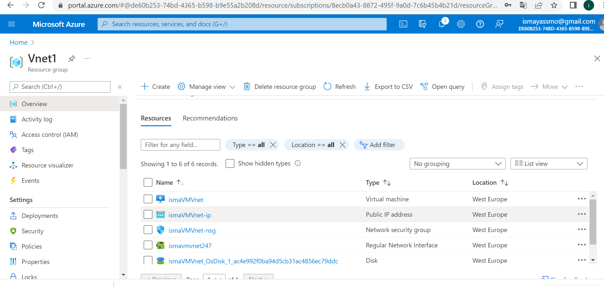
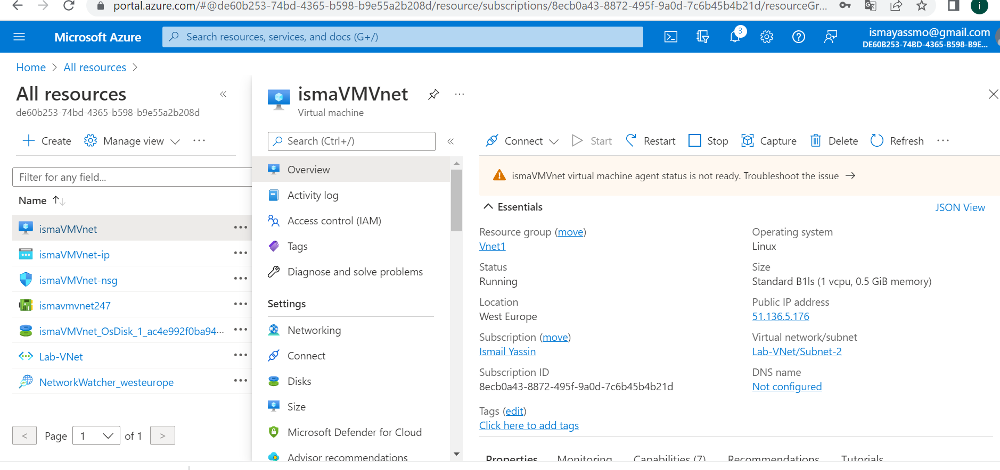
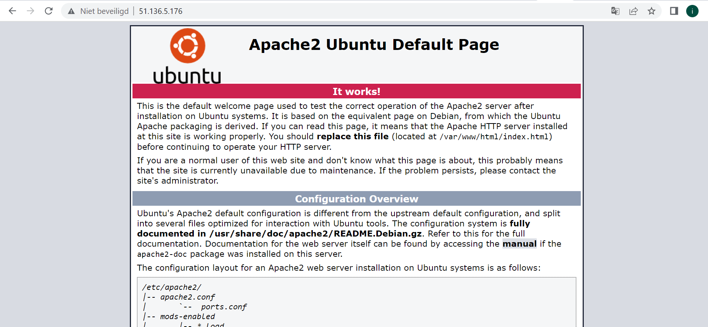

# Azure Virtual Network (VNet)

Vnet is the fundamental building block for your private network in Azure. Azure VNet enables resources such as VMs, web apps, and databases to communicate with each other, with users on the Internet, and with machines located on-premises.

VNets have the following responsibilities:

- (Network) isolation and segmentation
- Internet communication
- Communication between Azure resources
- Communication with on-premises resources
- Network traffic routing
- Filtering network traffic
- Connect to other VNets

When you create a new VNet, you define a private IP range for your network. You can create subnets within that range.

There are three ways to connect your network to an on-premises network:

1. Point to Site VPNs:
The Azure VNet is accessed with a VPN from an on-prem computer.

2. Site-to-site VPNs:
The on-prem VPN device or gateway is connected to the Azure VPN Gateway. This effectively gives you 1 large local network.

3. Azure Express Route:
This is a physical connection from your local environment to Azure.

You can also connect two Azure VNets using virtual network peering. This is made possible by user-defined Routing (UDR). Peering is possible with VNets in different regions.

### Task 1:

Create a Virtual Network with the following requirements:

- Region: Western Europe
- Name: Lab-VNet
- IP range: 10.0.0.0/16

**Prerequisites for Subnet 1**:

- Name: Subnet-1
- IP Range: 10.0.0.0/24
- This subnet must not have a route to the internet

**Prerequisites for Subnet 2**:

- ame: Subnet-2
- IP Range: 10.0.1.0/24

### Task 2:

**Create a VM with the following requirements:
An apache server must be installed with the following custom data**:

#!/bin/bash

sudo su

apt update

apt install apache2 -y

ufw allow 'Apache'

systemctl enable apache2

systemctl restart apache2

No SSH access is required, but HTTP

- Subnet: Subnet-2
- Public IP: Enabled

**Check if your website is reachable**

# Challenges overcame
Actually i did this assignment when I was creating the firewall in assignment 8, where I had to create a Vnet and VM. Then checked whether webserver was working with only HTTP and not with a SSH access.

# Sources

https://docs.microsoft.com/en-us/azure/virtual-network/virtual-networks-overview

https://docs.microsoft.com/en-us/azure/virtual-network/quick-create-portal

