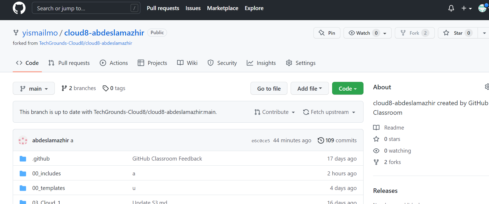

# Git and Github

## Key terminology

**Git**
Is a version control system which lets you track changes you make to your files over time. With Git, you can revert to various states of your files.

**Repository**
Contains the entire collection of files and folders associated with a project, along with each file's revision history.

**GitHub** 
Hosts Git repositories and provides developers with tools to ship better code through command line features, issues (threaded discussions), pull requests, code review, or the use of a collection of free and for-purchase apps in the GitHub Marketplace. 

**Main / Master**
the default branch can be named  as "master", but "main" is the standard name given to a branch of the repo.

**Branch**
is a  copy of a file that one would like to work on without messing up the original copy(main branch).

**Commit**

Git considers each commit a change point or "save point". It is a point in the project you can go back to if you find a bug, or want to make a change.

**Pull**

Pull is to clone a remote repository's from Github website into your computer/repository. This is is helpful especially when someone wants to work on their repo from a different computer or when they are contributing to an open source project online.

**Push**

pushing your modified files to GitHub

**Merge**

Join diffenret branches of a repo together.

**Fork**

Is to make a copy of a repo and make it into your own personal account.

### Sources

https://docs.github.com/en/get-started/using-git/about-git

https://www.freecodecamp.org/news/git-and-github-for-beginners/

### Overcome challanges

Simplifying the words to describe the key terminologies used. 

### Results

