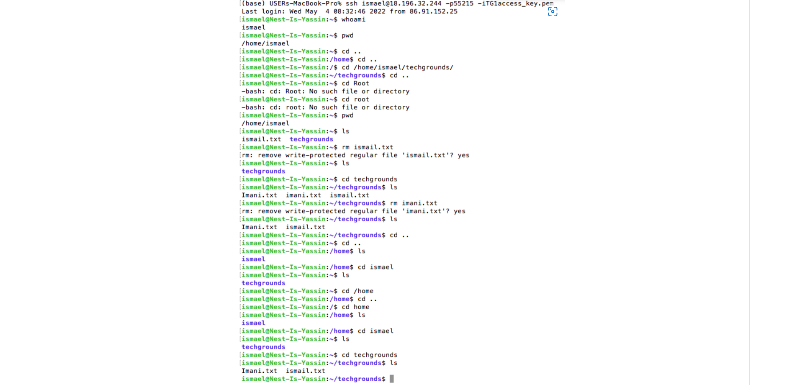

# Files and Directories

Introduction
Linux uses files and folders, like you’re used to with any OS you’ve used. Folders in Linux are called directories, so use that word when looking for commands or information.

Whenever you open a terminal, you’ll start working from your home directory. From there you can move to any directory in the entire system using just a couple of commands.

The Linux filesystem starts at the root directory, represented by a slash (/). All files and directories in Linux are represented by their path, starting from root.
The tilde (~) is used as an alias for your home directory.

Requirements:

Your Linux machine

# Exercise:
Find out your current working directory.

Make a listing of all files and directories in your home directory. You should see directories like ‘Desktop’, ‘Public’ and ‘Pictures’ among others.

Within your home directory, create a new directory named ‘techgrounds’.

Within the techgrounds directory, create a file containing some text.
Move around your directory

# Challenges overcame:

Learning the commands like cats and nano  

# sources
https://linuxhandbook.com/linux-directory-structure/