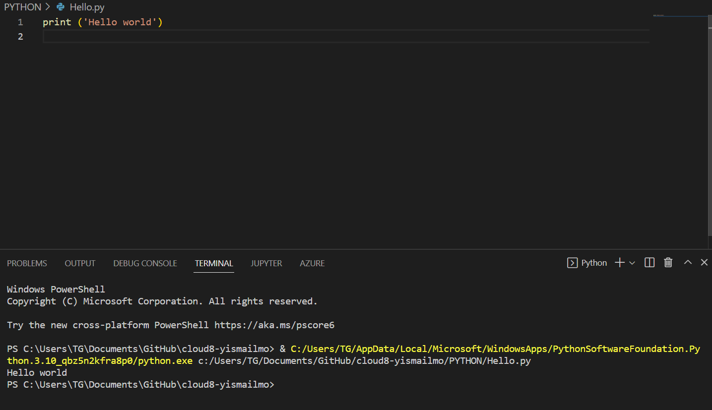

# Setting up
 


### Exercise:
Install the latest version of Python from https://www.python.org/
Install VS Code from https://code.visualstudio.com/download
Install the Python plug-in in VS Code.
Write the following Python code. The output in the terminal should be the text “Hello world!”



```Python
print ('Hello world')

```

### Challenges overcame

none as i could setup easily and also I had previous experience with python aswell.