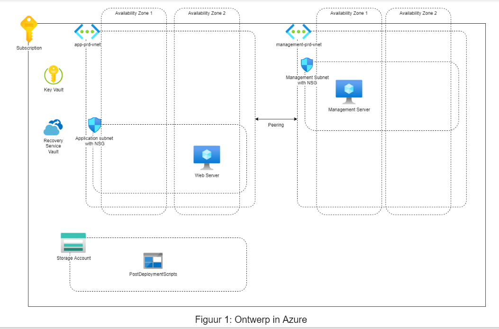

# Project architecture:

Build the Infrastructure as Code app using Bicep for the following architecture(this is just an example and i will add services to the design).

Small  incrementally changes has to be added to the application when bulding it and always have a commit / branch to fall back on with a working version of my application.

# Assumptions for the project:

For the webserver i will need to have a vnet and a second vnet for the admin/management server(because it should only be reachable from a trusted location).

# Services needed:
- 2 vnet (peered with 2 subnets)
- Vnet peering
- Resource group
- storage account
- key vault
-  2 vm
    - windows os for management/admin
    - Linux os for webserver
- Network Interface card
- Network Security group
- Recovery service vault
- PostDeploymentScripts

 