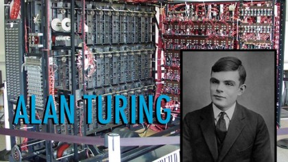
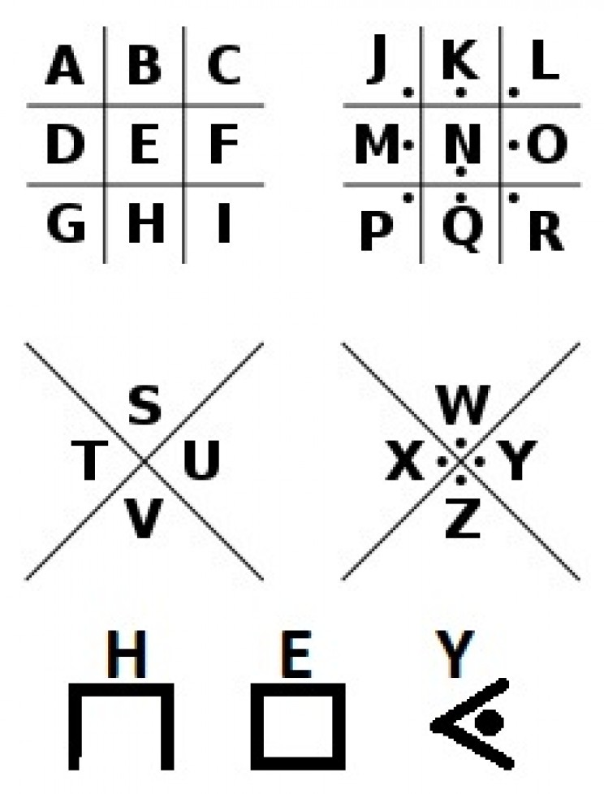
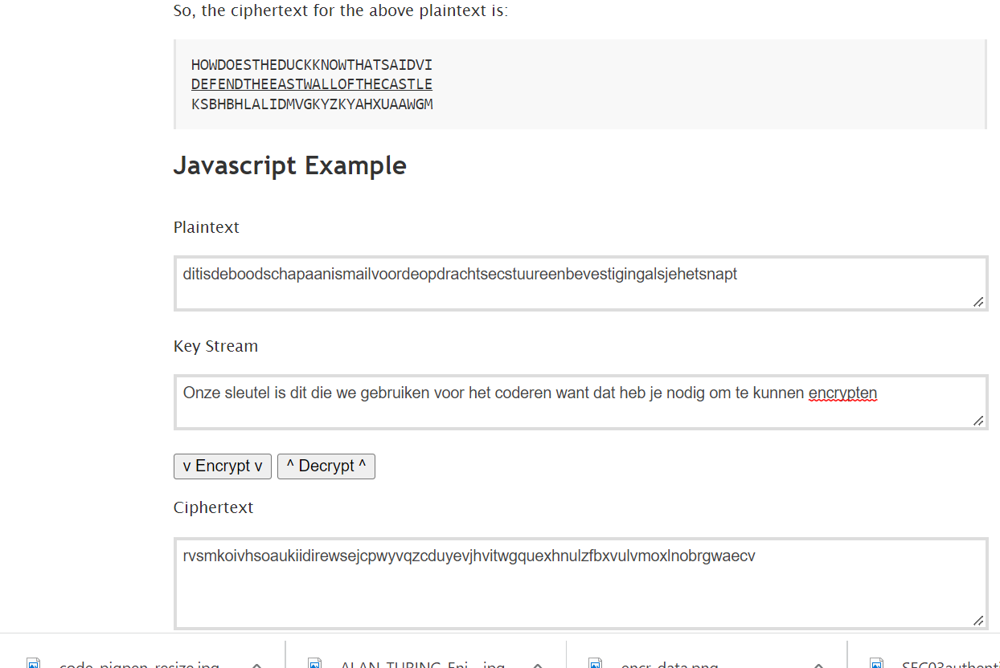

# Symmetric encryption

Introduction

Throughout history humanity has come up with many ciphers to encode information. Most of these are symmetric ciphers, the most famous one being the Caesar cipher.

### Key terminologies:

**cryptography**; 

It refers to the method used to protect sensitive information. 

So this means that it's mainly used to encrypt and decrypt data or messages that cannot be deciphered by unauthorized access. 

It deploys the use of scrambled or distorted symbols. It is simply used to provide extra security to ensure that only authorized users can understand the message. 

**Encryption**:

Is the process of converting data from a readable format to a scrambled piece of information. This is done to prevent prying eyes from reading confidential data in transit. Encryption can be applied to documents, files, messages, or any other form of communication over a network.

**Plaintext or cleartext** is the data that needs to be encrypted. The plaintext needs to be passed via some encryption algorithms, which are basically mathematical calculations to be done on raw information. There are multiple encryption algorithms, each of which differs by application and security index.

**ciphertext** is converting the plaintext into encrypted piece of data by using **Encryption key** and a suitable **encryption algorithm**.

**Decrption key**, is to convert the ciphertext back to its original readable format i.e. plaintext.

Instead of sending the plaintext to the receiver, the ciphertext is sent through insecure channels of communication. 

There are two types of Data encryption:

1. **Asymmetrical encryption**:

Also known as Public-Key Cryptography, encrypts and decrypts the data using two separate cryptographic asymmetric keys. These two keys are known as a “public key” and a “private key” which are mathematically linked.

The user employs one key for encryption and the other for decryption, though it doesn’t matter which you choose first.

Both keys are simply large numbers that aren’t identical but are paired with each other, which is where the “asymmetric” part comes in.

Common asymmetric encryption methods:

RSA: named after computer scientists Ron Rivest, Adi Shamir, and Leonard Adleman, is a popular algorithm used to encrypt data with a public key and decrypt with a private key for secure data transmission.

Public key infrastructure (PKI:

PKI is a way of governing encryption keys through the issuance and management of digital certificates.

2. **Symmetric Encryption**:

This method requires the sender and the receiver to have access to the same key(only one secret symmetric key is used). 

So, the recipient needs to have the key before the message is decrypted. 

***Symmetric encryption*** works best for closed systems, which have less risk of a third-party intrusion.

Common symmetric encryption methods:

Data Encryption Standards (DES):

DES is a low-level encryption block cipher algorithm that converts plain text in blocks of 64 bits and converts them to ciphertext using keys of 48 bits. 

Triple DES: Triple DES runs DES encryption three different times by encrypting, decrypting, and then encrypting data again.

Advanced Encryption Standard (AES): AES is often referred to as the gold standard for data encryption and is used worldwide as the U.S. government standard.
Twofish: Twofish is considered one of the fastest encryption algorithms and is free to use.

Requirements
The Slack channel your share with your group
A peer

### Exercise
##### Find two more historic ciphers besides the Caesar cipher.

1. Enigma code:

The term 'Enigma Code' is generally understood as the cipher device used by German forces during WW2 to encrypt their transmissions.

The brunt of the deciphering work was conducted by Polish code breakers and famously, Alun Turing and his team at Bletchley Park with his Bombe Enigma cracking machine.

2. The Pigpen cipher, as known as masonic or freemason cipher, is a geometric simple substitution cipher. It uses symbols to encode the letters within a message.

It is encoded and decoded by producing a grid or set of grids to produce the subsequent symbols.

###### Find two digital ciphers that are being used today.

1. SHA (Secure Hash Algorithm): SHA has been developed by the NSA. There have been multple versions, SHA-0 was flawed and quickly retracted. The most recent version is SHA-3 This is an example of a cryptographic hash function. 

Also Secure Socket Layer (SSL):

SSL uses the *RSA public-key* cryptosystem for the authentication steps. After the exchange of keys, a number of different cryptosystems are used, including RC2, RC4, IDEA, DES and triple-DES.

2. Electronic Money:

Encryption is used in electronic money schemes to protect conventional transaction data like account numbers and transaction amounts, digital signatures can replace handwritten signatures or a credit-card authorizations, and public-key encryption can provide confidentiality. 

There are several systems that cover this range of applications, from transactions mimicking conventional paper transactions with values of several dollars and up, to various micropayment schemes that batch extremely low cost transactions into amounts that will bear the overhead of encryption and clearing the bank.

#### Send a symmetrically encrypted message to one of your peers via the public Slack channel. They should be able to decrypt the message using a key you share with them. Try to think of a way to share this encryption key without revealing it to everyone. 

You are not allowed to use any private messages or other communication channels besides Slack. **Analyse the shortcomings of this method**.

Everyone can decrypt the message because this is on a public website and it's not secure way of sharing the key.

#### Challenges overcame:

Coming up with encrypted message to use in public slack channel.

### Sources

https://www.geeksforgeeks.org/difference-between-cryptography-and-cyber-security/

https://www.simplilearn.com/data-encryption-methods-article

https://www.ibm.com/topics/encryption

https://interestingengineering.com/11-cryptographic-methods-that-marked-history-from-the-caesar-cipher-to-enigma-code-and-beyond

https://www.laits.utexas.edu/~anorman/BUS.FOR/course.mat/SSim/life.html
