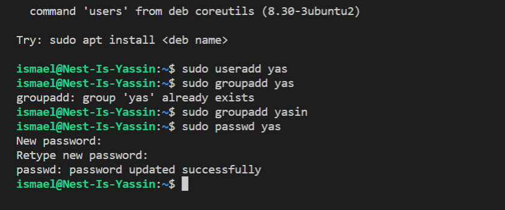
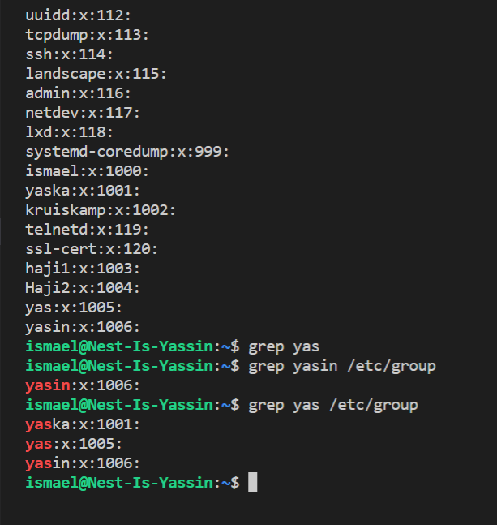

# Users and groups

introduction:

linux has users, similar to accounts on windows and macos. every user has their own home directory. users can also be part of groups.
there is a special user called ‘root’. Root is allowed to do anything.
To gain temporary root permissions, you can type ‘sudo’ in front of a command, but that only works if you’re allowed to do that.

Some actions require (root) permissions.

Users, passwords, and groups are all stored in  (different) files across the system.

# Key terminology

sudo "super user do" allows you to elevate your current user account to have root privileges (do whatever with the file).

cat to create, view, concatenate (merge) files.

etc/group  defines the groups to which users belong.

grep finds all the lines of a file that contain a particular word (grep "ẅord" filename)

# Exercise:
## Create a new user in your VM. 

sudo useradd yaska

The new user should be part of an admin group.

sudo groupadd yaska

The new user should have a password.
sudo passwd yaska

The new user should be able to use ‘sudo’
Locate the files that store users, passwords, and groups. See if you can find your newly created user’s data in there.

cat ect/group

to test if the new user data is created
grep yaska

### Sources

https://linuxize.com/post/how-to-add-user-to-group-in-linux/

https://linuxize.com/post/how-to-add-user-to-sudoers-in-ubuntu/

### Overcome challanges

Creating a user in my VM and navigating through vm.

### Results

