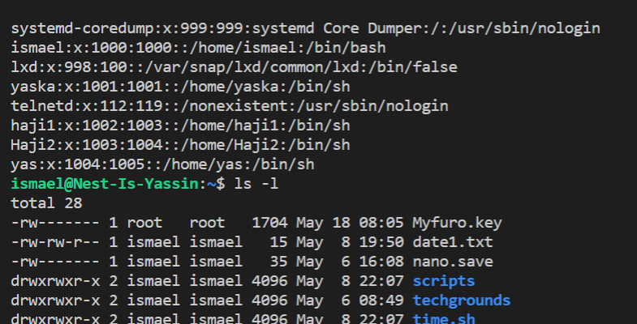
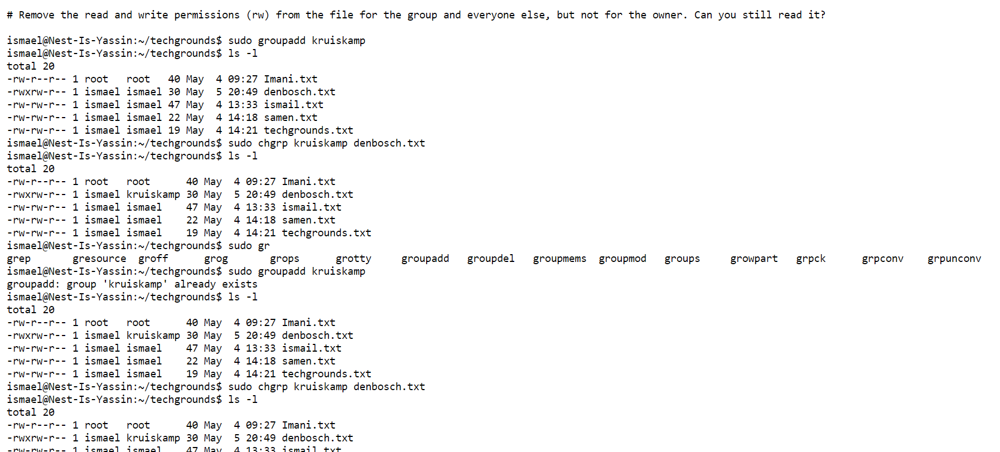
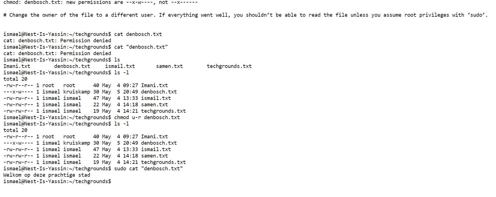
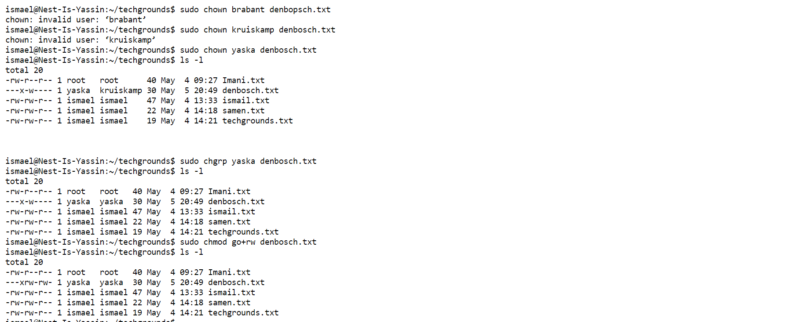

## File permissions

Linux system has three types of file ownerships:

1. user is the creator of the file thus the owner of the file. So the user can create, delete or modify the file he/she created.

2. Group contains multiple users with the same access permission to a file (create, delete or modify the file).

3. Other does not create a file and does not belong to a group like creating a role

You can view a file’s permissions by creating a long listing. A file’s permissions, as well as its owner and group, can be changed as well.

Any user listed in /etc/passwd can be assigned as owner of a file.

Any group listed in /etc/group can be assigned as the group of a file.

## Key terminology

- Every file in Linux contains a set of permissions. There are separate permissions for 

- rwx: reading, writing, and executing files.

- rw means that you read and write

- /etc/psswd or /etc/group is used to locally manage users & group.

- chgrp for changing the group owner

- chown for changing the owner of a file

- rw is for read and write (edit) permission

- r- is for only read permission

- ls -l command, ten characters are displayed before user owner and group. First character tells us about the type of the file.

## Exercise
Create a text file.

#### Who is the file’s owner and group? # What kind of permissions does the file have?

-rw-rw-r-- 1 ismael ismael   15 May  8 19:50 date1.txt

#### Make a long listing to view the file’s permissions.

#### Remove the read and write permissions (rw) from the file for the group and everyone else, but not for the owner. Can you still read it?

#### Change the owner of the file to a different user. If everything went well, you shouldn’t be able to read the file unless you assume root privileges with ‘sudo’.

#### Change the group ownership of the file to a different group.

### Sources
https://www.w3cschoool.com/linux-file-ownership

https://linuxize.com/post/chmod-command-in-linux/#:~:text=The%20permissions%20can%20have%20a,read%20permissions%20(%20r%2D%2D%20).&text=The%20file%20is%20not%20readable,cannot%20view%20the%20file%20contents.

https://www.cyberciti.biz/faq/how-to-use-chmod-and-chown-command/