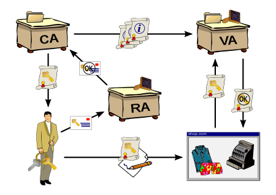
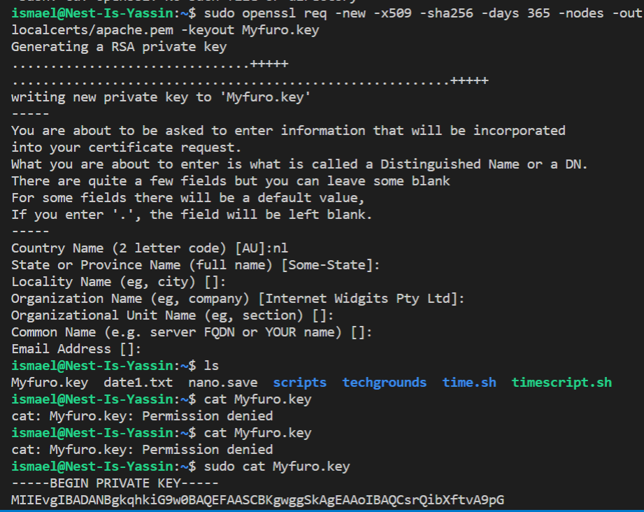
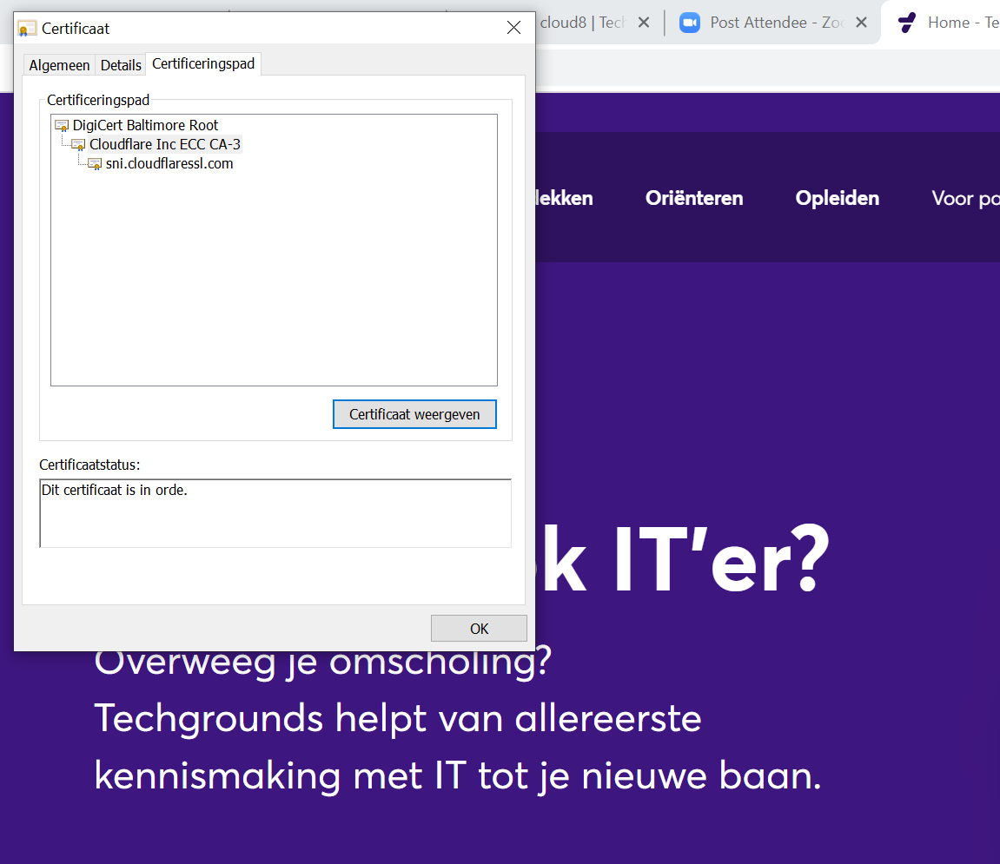
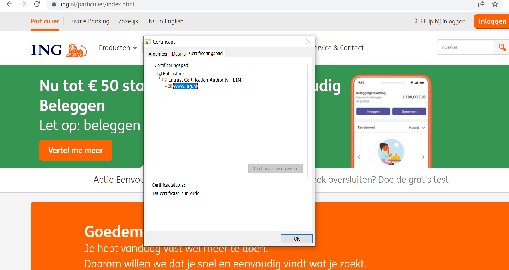
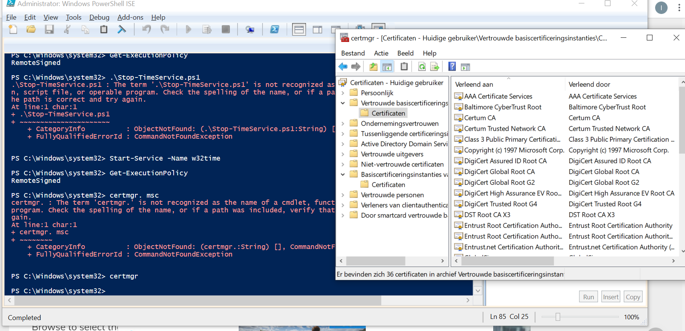
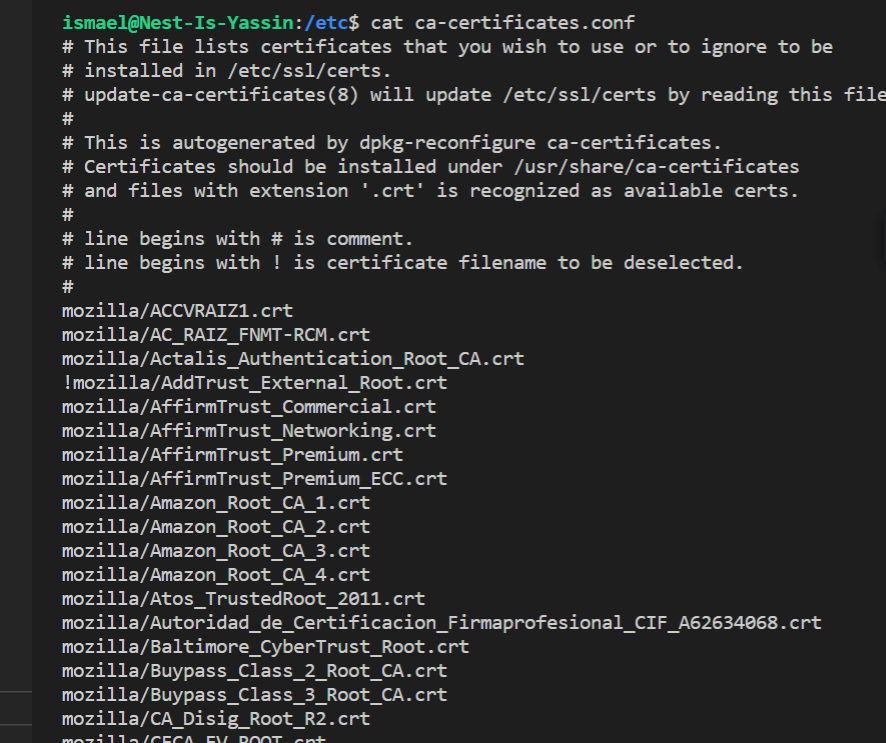

# Public Key Infrastructure

### Public Key Infrastructure (PKI);

 is a set of roles, policies, hardware, software and procedures needed to create, manage, distribute, use, store and revoke digital certificates and manage public-key encryption.

 The **importance of PKI** is this combination of encryption and authentication makes trustworthy online communication possible.

It consists of  **entities** that assure you can communicate securely over an insecure network like the public internet.

1. A certificate authority, which issues digital certificates, signs them with its own public key, and stores them for reference.
2. A registration authority, which verifies the identities of those requesting digital certificates. A CA can act as its own registration authority or can use a third party to do so.
A certificate database that stores both the certificates and metadata about them—most importantly, the period of time for which the certificate is valid.

A certificate policy outlining the PKI's procedures, which allows outsiders to judge how trustworthy the PKI is.

X.509 is the standard which defines the process in which a PKI should function. 

Hence digital certificates are sometimes also referred to as 
X.509 certificates.

Digital certificates are based on the ITU standard X.509 which defines a standard certificate format for public key certificates and certification validation. 

PKI facilitates trusting the actions or outputs of entities, be they people or computers. 

PKI objectives respect one or more of the following capabilities: Confidentiality, Integrity and Authenticity (CIA)

There have traditionally been three approaches to getting this trust: certificate authorities (CAs), web of trust (WoT), and simple public key infrastructure (SPKI).

### Key terminology
OpenSSL: This is the basic command line tool for creating and managing OpenSSL certificates, keys, and other files. req -x509: This specifies that we want to use X.509 certificate signing request (CSR) management. The "X.509" is a public key infrastructure standard that SSL and TLS adhere to for key and certificate management.

nodes: This tells OpenSSL to skip the option to secure our certificate with a passphrase. We need Apache to be able to read the file, without user intervention, when the server starts up. A passphrase would prevent this from happening, since we would have to enter it after every restart.

days 365: This option sets the length of time that the certificate will be considered valid. We set it for one year here.

newkey rsa:2048: This specifies that we want to generate a new certificate and a new key at the same time. We did not create the key that is required to sign the certificate in a previous step, so we need to create it along with the certificate. The rsa:2048 portion tells it to make an RSA key that is 2048 bits long.

keyout: This line tells OpenSSL where to place the generated private key file that we are creating.

out: This tells OpenSSL where to place the certificate that we are creating.

Requirements
Your Linux machine
An internet browser

Exercise
#### Create a self-signed certificate on your VM.

First I need to install required packages for OpenSSL, the open source SSL toolkit.

 Then i used openssl to generate a new RSA private key in 'Myfuro.key'

#### Analyze some certification paths of known websites (ex. techgrounds.nl / google.com / ing.nl).

.png)

#### Find the list of trusted certificate roots on your system (bonus points if you also find it in your VM).

I found out about the certifacates in my system by typing to 'certmgr' in powershell, then went to the certifactions file.

### Challenges overcssme

Learning about PKI and different entities that assure secure online communications. Generating RSA private key on my vm. 

### Sources

https://www.tutorialspoint.com/cryptography/public_key_infrastructure.htm

https://www.csoonline.com/article/3400836/what-is-pki-and-how-it-secures-just-about-everything-online.html

https://en.wikipedia.org/wiki/Public_key_infrastructure

https://www.bogotobogo.com/Linux/Linux-How-to-Make-a-Self-Signed-SSL-Certificate.php

https://en.wikipedia.org/wiki/OpenSSL
