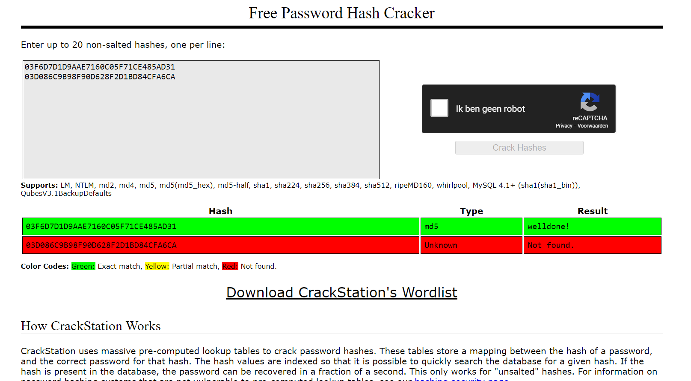

# Passwords

Introduction

In terms the three common factors used for authentication:

1. Something you know (such as a password).

2. Something you have (such as a smart card)

3. Something you are (such as a fingerprint or other biometric method)

So, passwords fall into the ‘something you know’ category.

On the front-end, passwords can be guessed. This can be made harder with the following strategies:

	- Not using common passwords
	- Using longer passwords
	- Using special characters like @,*,%, etc.
	- Using a mixture of CAPITAL and small letters
	- Not using easily deducible passwords like birthdates or pet names
	- Using a different password for every login
	- Using a sentence

Of course, these strategies make it harder to remember your own passwords. Password managers were created to solve this problem.

On the back-end, passwords need to be stored securely. If your database (or /etc/shadow file in Linux) gets leaked or stolen, you don’t want anyone to just be able to read passwords in plaintext. This is why most stored passwords are hashed. Hackers will try to use a Rainbow Table to crack hashed passwords.

Key Terminology:

**/etc/shadow** is a text-based password file. The shadow file stores the hashed passphrase (or “hash”) format for Linux user account with additional properties related to the user password.

contains one entry per line, each representing a user account. You can view the contents of the file, with a text editor or a command such as cat.

MD5: MD5(message-digest algorithm) is a one-way cryptographic function that accepts a message of any length as input and returns as output a fixed-length digest value to be used for authenticating the original message. It used to be the most popular hash algorithm which converted a 16-byte hash value to a 32-bit hexadecimal number. It has been deprecated from use because of vulnerabilities found in it, but it can still be used as a checksum to verify data integrity only against unintentional corruption.

SHA-0: SHA-0 is the first SHA algorithm of the three groups of SHA algorithms. SHA-0 has been deprecated from use thanks to its susceptibilities. This algorithm was soon replaced by the SHA-1 algorithm.

SHA-1: SHA-1 is the successor of the SHA-0 and became the most widely adopted algorithm of the SHA family. It produces a 160-bit (20-byte) hash value known as a message digest — typically rendered as a hexadecimal number that’s 40 digits long. However, it was found to be insecure and since 2010, many organizations recommended its replacement with SHA-2 algorithms. In 2017, all major browsers deprecated the use of SHA-1.

SHA-2 replaced SHA-1 and became the most widely adopted hashing algorithm. It might be carrying the family name but SHA-2 is significantly different from its predecessor. The SHA-2 family consists of SIX hash functions — SHA-224, SHA-256, SHA-384, SHA-512, SHA-512/224, SHA-512/256 — with digests (hash values) that are 224, 256, 384 or 512 bits.

**Collision** is when two keys  generate an identical hash. 

**Salting** is to ensure the uniqueness of encrypted outputs, by adding random data into the hash function. This approach, guarantees a unique output even when the inputs are identical. The unique and random string of characters are placed in front of each password.

Requirements
Your Linux machine
A peer
An online Rainbow Table like https://crackstation.net/

# Exercises

#### What is Hashing?:

Hashing is the process of transforming any given key or a string of characters(big numbers) into another value (small numbers).

Therefore hashing is a technique or process of mapping keys, values into the hash table by using a hash function. It is done for faster access to elements.

**Hash Function**: 

A function that converts a given big number to a small practical integer value.

**Hash table**:

An array that stores pointers to records corresponding to a given number. An entry in hash table is NIL if no existing number has hash function value equal to the index for the entry. 

#### why Hashing is preferred over symmetric encryption for storing passwords.

The biggest difference between Symmetric encryption and Hashing is that, Symmetric encryption is reversible because the data can be encrypted and decrypted using the same cryptographic key. — hashing is not reversible because it is one-way process that uses an algorithm to take data and convert it to a fixed length known as a hash value (also known as a hash digest).

#### Find out how a Rainbow Table can be used to crack hashed passwords.

Rainbow tables are tables of reversed hashes used to crack password hashes. Computer systems requiring passwords typically store the passwords as a hash value of the user’s password. When a computer user enters a password, the system hashes the password and compares it to the stored hash. 

#### Below are two MD5 password hashes. One is a weak password, the other is a string of 16 randomly generated characters. Try to look up both hashes in a Rainbow Table.

03F6D7D1D9AAE7160C05F71CE485AD31
03D086C9B98F90D628F2D1BD84CFA6CA

From the picture it is clear that when the hash is present in the database(https://crackstation.net/), the password can be recovered in a fraction of a second (it was a match because it is a weak password), while the other password consists of 16 randomly generated characters.

#### Create a new user in Linux with the password 12345. 

Create a new user by 
**sudo useradd then name**.

Then give the user a password by **sudo passwd then name of the new user created** .

After I used the command 
**sudo tail /etc/shadow** to see my hashed password:

Look up the hash in a Rainbow Table.

Despite the bad password, and the fact that Linux uses common hashing algorithms, I can't get a match in the Rainbow Table. This is because the passwords are salted even when comparing to a teammate with the same password. 

### Challenges overcame
Learning about hashing, salting and also using the rainbow table for the salted passwords.
### Sources:

https://en.wikipedia.org/wiki/Hash_function#Overview

https://www.geeksforgeeks.org/hashing-set-1-introduction/

https://comodosslstore.com/resources/hashing-vs-encryption-simplifying-the-differences/#:~:text=There%20is%20no%20use%20of,and%20private%20keys%20are%20used.

https://www.techtarget.com/searchdatamanagement/definition/hashing

https://www.cyberciti.biz/faq/understanding-etcshadow-file/

https://linuxize.com/post/etc-shadow-file/
